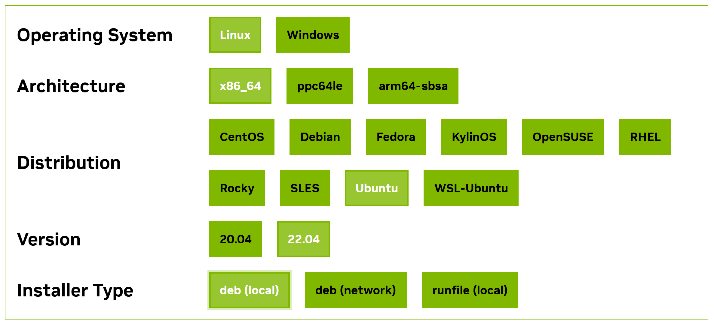
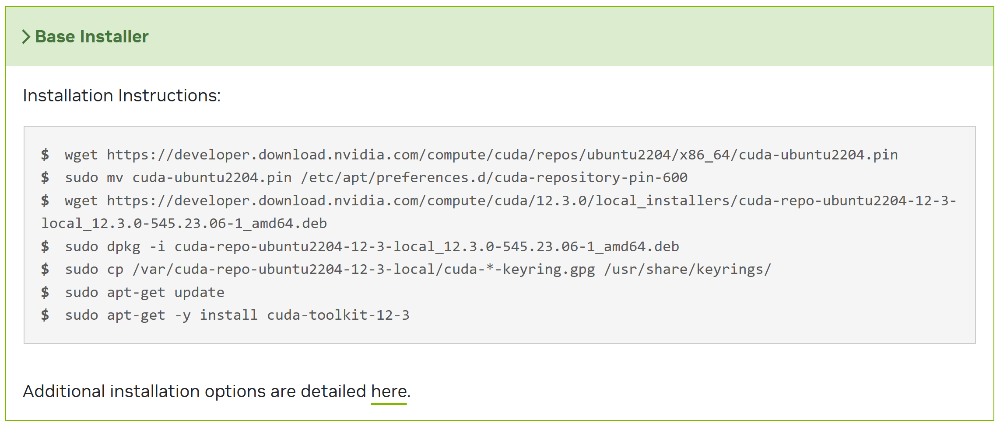
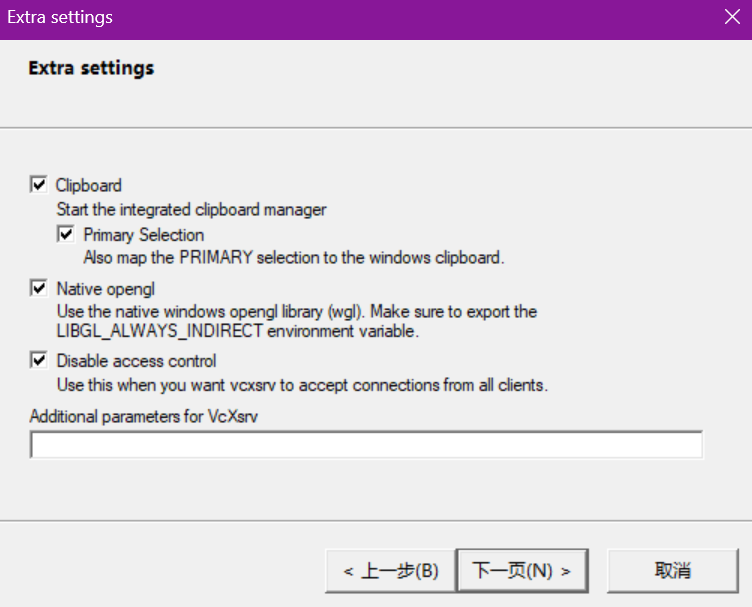

# WSL使用注意事项/踩坑

## WSL移动VHDX位置

```powershell
wsl --shutdown

# 替换为你想要的打包路径
wsl --export Ubuntu-22.04 D:\Ubuntu_WSL\Ubuntu.tar

# 注销原有的Ubuntu
wsl --unregister Ubuntu-22.04

# 导入为新的Ubuntu，注意替换想要存放的vhdx的新的路径
wsl --import Ubuntu-22.04 D:\Ubuntu_WSL D:\Ubuntu_WSL\Ubuntu.tar
```

这样移动过后，点开wsl会发现默认用户切换为了root。可以在wsl中设置后重启：

```bash
vim /etc/wsl.conf

# 添加以下内容，注意替换用户名
# [user]
# default=user_name 
# 然后windows中wsl --shutdown后重启wsl
```

另外注意，虽然移动了光盘映像的位置，但是产生的Temp文件还是在系统盘`C:\Users\<你的用户名>\AppData\Local\Temp`（可能和一些环境变量设置有关）。

## WSL修改内存大小

需要编辑`C:\Users\<你的用户名>\.wslconfig`（如果不存在则自己创建）。根据自己电脑实际设置，一些高级设置请参考[官网](https://learn.microsoft.com/zh-cn/windows/wsl/wsl-config)。

```
[wsl2]
memory=32GB
processors=16
swap=8GB
localhostForwarding=true
```

玄学：FSL有时候闪退，将使用的processors调小后变得稳定，不知道是什么原因。

## WSL VHDX文件过大

WSL光盘映像文件只会扩容，不会缩小（删除里面的文件不会减少占用的空间大小）。

参考https://blog.csdn.net/C_lonq/article/details/133930176

```powershell
wsl --shutdown
Diskpart
select vdisk file="path/to/your/wsl.vhdx"
compact vdisk
```

## 启动WSL提示分发错误

[Unable to launch wsl2](https://github.com/microsoft/WSL/issues/11474)里面有详细的解决方法（简单来说需要创建一个新的wsl系统，然后修复原来的VHDX文件）

这里也简单记录一下过程：
1. 备份之前的vhdx文件
   原始文件在默认`%USERPROFILE%\AppData\Local\Packages\CanonicalGroupLimited.Ubuntu_79rhkp1fndgsc\LocalState\ext4.vhdx`。如果之前移动了位置，请找打对应的路径。将其复制一份到其他位置，以免恢复过程中失败...
   假设复制到了`/mnt/path/to/your/ext4.vhdx`。

2. 创建一个新的wsl系统
   这里对版本没有要求，注意不要和之前的重名了就行了。
   ```powershell
   wsl --install -d Ubuntu-22.04
   ```

3. 打开新创建的wsl系统，等待初始化完成。
   安装需要的工具
   ```bash
   sudo apt update
   sudo apt install qemu-utils
   ```

4. 修复原来的vhdx文件
   ```bash
   sudo modprobe nbd
   sudo qemu-nbd -c /dev/nbd0 -f vhdx /mnt/path/to/your/ext4.vhdx
   # 这一步中间会询问修复操作，输入a代表所有yes
   # 结束之后
   sudo qemu-nbd -d /dev/nbd0
   ```

5. 替换文件
   ```powershell
   wsl --shutdown
   ```
   将/mnt/path/to/your/ext4.vhdx复制到原来的位置，覆盖掉原来的文件。之后应该可以正常打开。

## WSL2适配CUDA

在[WMH-SynthSeg的使用](../CSVD/WMH-SynthSeg使用过程记录.md)中已经记录了这一问题。这里记录几个要点。

### 不要在WSL2中单独安装NVIDIA驱动！

只需要在Windows系统中安装nvidia驱动，而不用在wsl中安装。如果`nvidia-smi`命令有问题，那很可能就是在wsl2中安装了nvidia驱动覆盖了默认配置好的路径，需要删掉：

```bash
sudo apt-get purge -y '*nvidia-driver*' '*nvidia-kernel*' '*libnvidia*'
sudo apt autoremove -y
sudo apt clean
```

### 安装CUDA

下载前请注意所使用软件的CUDA与cudnn的适配，以及pytorch或tensorflow的版本要求！！！

打开[CUDA Toolkit](https://developer.nvidia.com/cuda-downloads?target_os=Linux&target_arch=x86_64)的下载网站，一般下载最新的可能与其他软件不兼容，请下滑到Resources栏选择Archive of Previous CUDA Releases。按照系统选择（如下图），这里似乎选择Ubuntu和WSL-Ubuntu没有什么区别。



选择之后下面会出现命令，按照这个命令就可以安装了。



然后在`.bashrc`中更新环境变量
```bash
# 注意替换自己的cuda版本，看下在/usr/local中的文件夹名称是什么
export CUDA_HOME=/usr/local/cuda-12.3
export PATH=$PATH:$CUDA_HOME/bin
export LD_LIBRARY_PATH=/usr/local/cuda-12.3/lib64${LD_LIBRARY_PATH:+:${LD_LIBRARY_PATH}}
```

安装后，运行`nvcc -V`应该能正常输出。

### 安装cudnn

进入[cudnn](https://developer.nvidia.com/rdp/cudnn-archive)的网站，选择适合的cudnn版本（下载需要登录nvidia，好像可以找其它不需要登录的方法）。我选择的是Local Installer for Linux x86_64 (Tar)，下面的Local Installer for Ubuntu22.04 x86_64 (Deb)应该也可以。假设下载到了当前目录：

```bash
# 请替换cudnn-linux-x86_64-8.9.6.50_cuda12-archive.tar.xz为实际路径
tar -xvf cudnn-linux-x86_64-8.9.6.50_cuda12-archive.tar.xz

# 请确定解压后的目录是否为cuda，以及/usr/local下的cuda文件夹名称
sudo cp -P cuda/include/cudnn*.h /usr/local/cuda-12.3/include
sudo cp -P cuda/lib/libcudnn* /usr/local/cuda-12.3/lib64
sudo chmod a+r /usr/local/cuda-12.3/include/cudnn*.h
sudo chmod a+r /usr/local/cuda-12.3/lib64/libcudnn*
```

之后应该可以正常使用了。

## WSL安装matlab

参考Linux下安装matlab的步骤（一般是把iso文件挂载到WSL，然后运行安装文件）

如果出现glib/pango库的问题（注意替换为matlab安装包的路径）：

```bash
./install terminate called after throwing an instance of 'std::runtime_error' what(): Unable to launch the MATLABWindow application
```

可以通过运行./MATLABWindow来查看具体错误

```bash
cd ~/matlab_installer/bin/glnxa64

./MATLABWindow -url=mathworks.com ./MATLABWindow: symbol lookup error: /usr/lib/x86_64-linux-gnu/libgdk_pixbuf-2.0.so.0: undefined symbol: g_task_set_name
```

Mathwork官网提供了解决方案：https://www.mathworks.com/matlabcentral/answers/364551-why-is-matlab-unable-to-run-the-matlabwindow-application-on-linux

如果无法解决库冲突的问题，可以尝试silent安装：

安装包文件夹下存在`installer_input.txt`模板文件，可以修改其中的注释掉的内容指定安装步骤，例如不安装额外包的话，可以指定：

```
##################################################################
## MATLAB Silent Installation Config (R2020a)
##################################################################

## 安装目录
destinationFolder=/usr/local/MATLAB/R2020a

## 使用的 File Installation Key
fileInstallationKey=09806-07443-53955-64350-21751-41297

## 接受许可证协议
agreeToLicense=yes

## 输出日志文件（可选）
outputFile=/tmp/matlab_install.log
```

## WSL使用GUI

Windows下安装[VcXsrv](https://sourceforge.net/projects/vcxsrv/)，按照默认配置安装后，桌面会出现XLaunch的快捷方式，双击打开选择One large window, Display number选择0，后面有一个界面选择disable access control。




之后在WSL设置环境变量：

```bash
export DISPLAY=localhost:0
```

可通过`xclock`测试是否能打开图形化界面