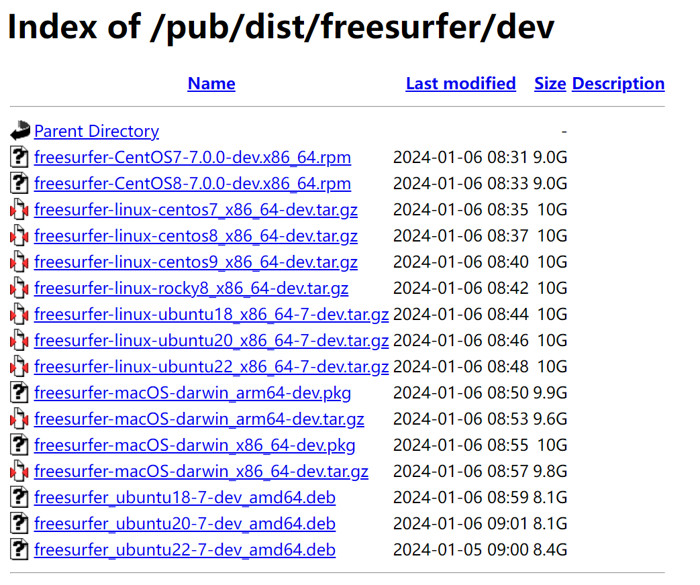
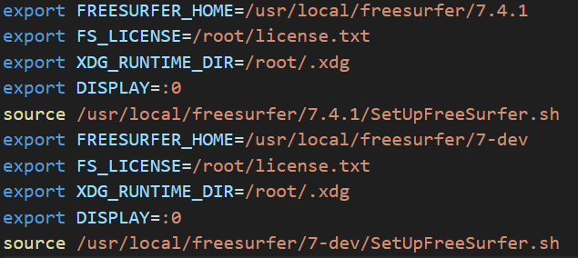
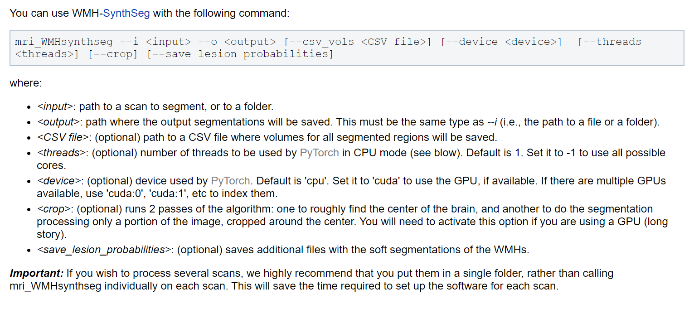
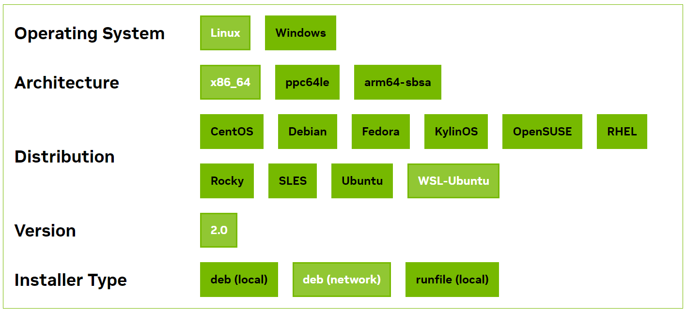
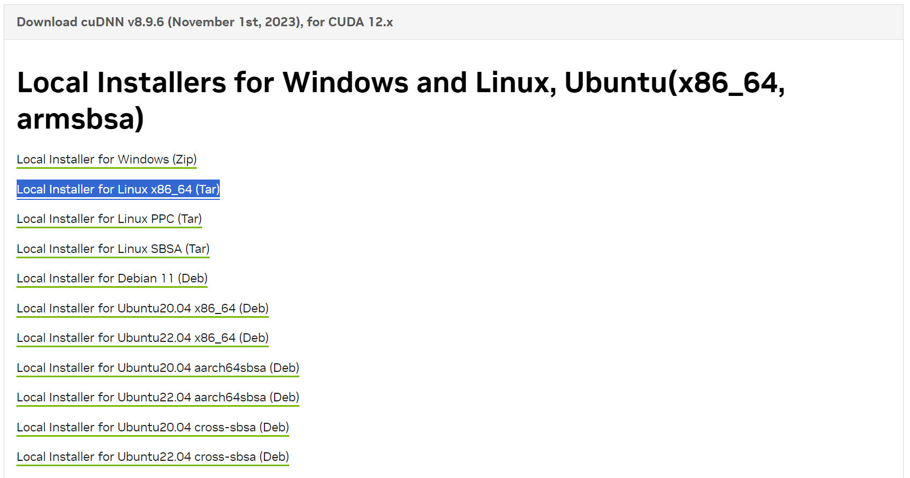
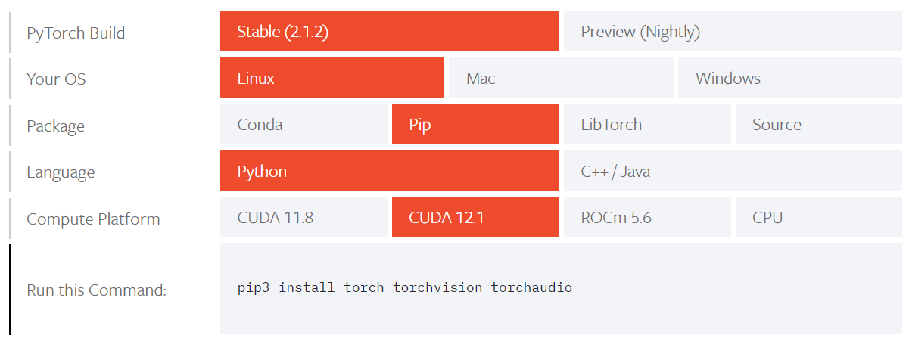
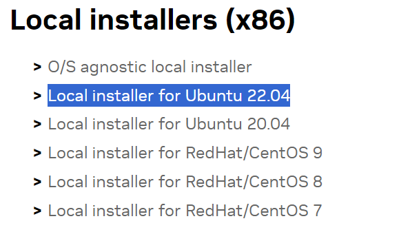
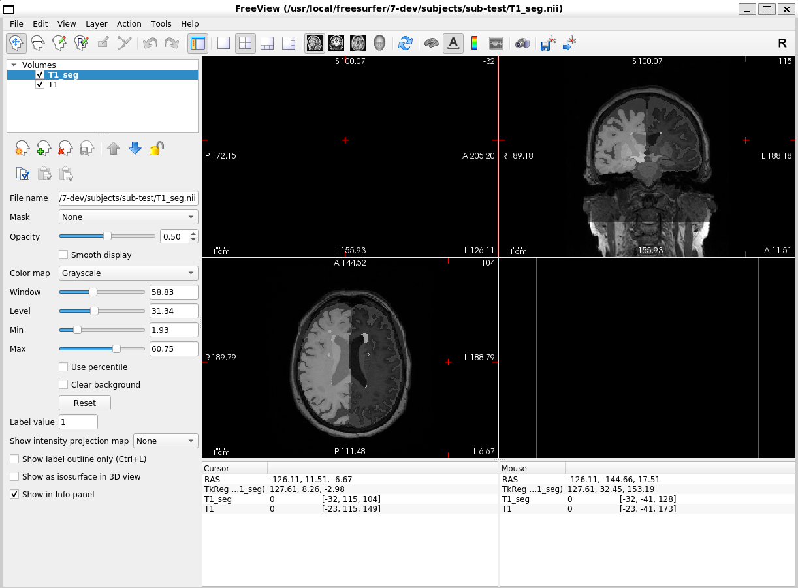

# Freesurfer WMH-SynthSeg使用过程记录

## Step 0：准备
本地环境：**Windows10** + **WSL2** + **Ubuntu 22.04**  
时间：2024-01-07

## Step 1：选择合适的Freesurfer7的开发版本
根据此时Freesurfer的官方说明（[WMH-SynthSeg](https://surfer.nmr.mgh.harvard.edu/fswiki/WMH-SynthSeg)），WMH-SynthSeg只能通过开发版本使用。下面是开发版本的安装过程：

**选择合适的Freesurfer版本**：在该页面中找到"Development Version"（[FreeSurfer Download and Install](https://surfer.nmr.mgh.harvard.edu/fswiki/DownloadAndInstall)）或直接进入[Index of /pub/dist/freesurfer/dev](https://surfer.nmr.mgh.harvard.edu/pub/dist/freesurfer/dev/)选择合适的开发版本。  
  
根据我的环境，我选择的是最后一个（freesurfer_ubuntu22-7-dev_amd64.deb）。相应地，修改**Step 2**中的下载路径。  


## Step 2：安装Freesurfer的开发版本
过程参考Freesurfer官方安装指南（[Freesurfer on Ubuntu Linux in WSL](https://surfer.nmr.mgh.harvard.edu/fswiki/FS7_wsl_ubuntu)），因为版本不同，修改相应的地方即可。具体安装过程如下：  
```bash
# 进入HOME路径
root@LXG:~# cd

# 下载开发版本的.deb文件
root@LXG:~# wget https://surfer.nmr.mgh.harvard.edu/pub/dist/freesurfer/dev/freesurfer_ubuntu22-7-dev_amd64.deb

# 检查下载的文件是否存在
root@LXG:~# ls freesurfer_ubuntu22-7-dev_amd64.deb

# 更新Ubuntu相关的包
root@LXG:~# sudo apt-get update -y

# 安装开发版本
# 注意：这一步提示已经安装，因此我卸载了之前安装的Freesurfer版本（7.4.1）
root@LXG:~# sudo apt-get -y install ./freesurfer_ubuntu22-7-dev_amd64.deb

# 添加环境变量
root@LXG:~# export FREESURFER_HOME=/usr/local/freesurfer/7-dev
root@LXG:~# echo "export FREESURFER_HOME=/usr/local/freesurfer/7-dev" >> $HOME/.bashrc

# 添加license和相关变量。事先将license.txt放在HOME路径中
root@LXG:~# cd
root@LXG:~# ls license.txt
root@LXG:~# echo "export FS_LICENSE=$HOME/license.txt" >> $HOME/.bashrc

# 其它环境变量
root@LXG:~# echo "export XDG_RUNTIME_DIR=$HOME/.xdg" >> $HOME/.bashrc
root@LXG:~# echo "export DISPLAY=:0" >> $HOME/.bashrc
root@LXG:~# echo "source $FREESURFER_HOME/SetUpFreeSurfer.sh" >> $HOME/.bashrc
```
编辑$HOME/.bashrc文件，将其中之前版本的变量信息删除（如图中的前一部分，为7.4.1版本的环境变量）
   
重新启动Ubuntu，看到如下提示说明安装成功：   
-------- freesurfer-linux-ubuntu22_x86_64-dev-20240105-87ffad0 --------  
Setting up environment for FreeSurfer/FS-FAST (and FSL)  
FREESURFER_HOME   /usr/local/freesurfer/7-dev  
FSFAST_HOME       /usr/local/freesurfer/7-dev/fsfast  
FSF_OUTPUT_FORMAT nii.gz  
SUBJECTS_DIR      /usr/local/freesurfer/7-dev/subjects  
MNI_DIR           /usr/local/freesurfer/7-dev/mni  
FSL_DIR           /usr/local/fsl

## Step 3：配置WSL2 Ubuntu的Cuda和Pytorch
尝试使用一下命令`root@LXG:~# mri_WMHsynthseg`，发现如下提示：  
```
Atlas files not found. Please download atlas from:  
https://ftp.nmr.mgh.harvard.edu/pub/dist/lcnpublic/dist/Histo_Atlas_Iglesias_2023/atlas.zip and uncompress it into: /usr/local/freesurfer/7-dev/models/ You only need to do this once. You can use the following commands (may require root access):   
1: cd /usr/local/freesurfer/7-dev/models/   
2a (in Linux): wget https://ftp.nmr.mgh.harvard.edu/pub/dist/lcnpublic/dist/WMH-SynthSeg/WMH-SynthSeg_v10_231110.pth   
2b (in MAC): curl -o WMH-SynthSeg_v10_231110.pth https://ftp.nmr.mgh.harvard.edu/pub/dist/lcnpublic/dist/WMH-SynthSeg/WMH-SynthSeg_v10_231110.pth   
After correct download and instillation, the directory: /usr/local/freesurfer/7-dev/models/ should now contain an additional file: WMH-SynthSeg_v10_231110.pth  
```
因此根据提示，执行如下命令下载文件：
```bash
root@LXG:~# cd /usr/local/freesurfer/7-dev/models/
root@LXG:/usr/local/freesurfer/7-dev/models# wget https://ftp.nmr.mgh.harvard.edu/pub/dist/lcnpublic/dist/WMH-SynthSeg/WMH-SynthSeg_v10_231110.pth
```
下载完成后，可以在"/usr/local/freesurfer/7-dev/models/"文件夹找到上面说的文件（WMH-SynthSeg_v10_231110.pth）。
准备了一个被试的T1像（usr/local/freesurfer/7-dev/subjects/sub-test/T1.nii），根据官方页面的教程（[WMH-SynthSeg](https://surfer.nmr.mgh.harvard.edu/fswiki/WMH-SynthSeg)），我使用的命令为`mri_WMHsynthseg --i /usr/local/freesurfer/7-dev/subjects/sub-test --o /usr/local/freesurfer/7-dev/subjects/sub-test --device cuda --crop --save_lesion_probabilities`。

```
# 命里的基本含义
# --i和--o：指定input和output路径，需要保持类型一致。我的命令行都选择被试文件夹
# --csv_vols（可选）：保存csv文件结果
# --threads（可选）：使用的核心数目。默认1，使用全部可用核心-1
# --device（可选）：'cpu'（默认），'cuda'使用GPU，有多张显卡可以指定'cuda:0'，'cuda:1'等
# --crop（可选）：使用GPU必须加上--crop
# --save_lesion_probabilities（可选）：多生成一个结果文件（WMH分割的probabilities map）
```
但执行命令时报错：
```
root@LXG:~# mri_WMHsynthseg --i /usr/local/freesurfer/7-dev/subjects/sub-test --o /usr/local/freesurfer/7-dev/subjects/sub-test --device cuda --crop --save_lesion_probabilities 
Arguments seem correct; loading Python packages... 
Traceback (most recent call last): 
File "/usr/local/freesurfer/7-dev/python/lib/python3.8/site-packages/torch/__init__.py", line 174, in _load_global_deps ctypes.CDLL(lib_path, mode=ctypes.RTLD_GLOBAL) File "/usr/local/freesurfer/7-dev/python/lib/python3.8/ctypes/__init__.py", line 373, in __init__ self._handle = _dlopen(self._name, mode) OSError: libcufft.so.11: cannot open shared object file: No such file or directory During handling of the above exception, another exception occurred: 
Traceback (most recent call last): 
File "/usr/local/freesurfer/7-dev/python/packages/WMHSynthSeg/inference.py", line 284, in <module> main() File "/usr/local/freesurfer/7-dev/python/packages/WMHSynthSeg/inference.py", line 76, in main import torch File "/usr/local/freesurfer/7-dev/python/lib/python3.8/site-packages/torch/__init__.py", line 234, in <module> _load_global_deps() File "/usr/local/freesurfer/7-dev/python/lib/python3.8/site-packages/torch/__init__.py", line 195, in _load_global_deps _preload_cuda_deps(lib_folder, lib_name) File "/usr/local/freesurfer/7-dev/python/lib/python3.8/site-packages/torch/__init__.py", line 160, in _preload_cuda_deps raise ValueError(f"{lib_name} not found in the system path {sys.path}") ValueError: libcublas.so.*[0-9] not found in the system path ['/usr/local/freesurfer/7-dev/python/packages/WMHSynthSeg', '/usr/local/freesurfer/7-dev/python/packages', '/usr/local/freesurfer/7-dev/python/lib/python38.zip', '/usr/local/freesurfer/7-dev/python/lib/python3.8', '/usr/local/freesurfer/7-dev/python/lib/python3.8/lib-dynload', '/usr/local/freesurfer/7-dev/python/lib/python3.8/site-packages']
```
提示缺少`libcufft.so.11`和`libcublas.so.*[0-9]`库。进一步在Ubuntu 22.04中查看CUDA`nvcc --version`没有正常输出。不论是使用GPU还是CPU的指令应该都需要通过Pytorch加速，使用这个功能之前没有在WSL2中安装过CUDA和Pytorch，因此找教程从头安装。接下来主要参考的教程是[Windows 11/10 WSL2 Ubuntu 20.04 下配置Cuda及Pytorch](https://blog.csdn.net/iwanvan/article/details/122119595)，详细步骤如下：
###  （1）查看Windows物理机内的CUDA和WSL2中的CUDA
```
PS C:\Users\Xiaog> nvidia-smi
Fri Jan 12 10:01:01 2024
+---------------------------------------------------------------------------------------+
| NVIDIA-SMI 546.17                 Driver Version: 546.17       CUDA Version: 12.3     |
|-----------------------------------------+----------------------+----------------------+
| GPU  Name                     TCC/WDDM  | Bus-Id        Disp.A | Volatile Uncorr. ECC |
| Fan  Temp   Perf          Pwr:Usage/Cap |         Memory-Usage | GPU-Util  Compute M. |
|                                         |                      |               MIG M. |
|=========================================+======================+======================|
|   0  NVIDIA GeForce RTX 4090      WDDM  | 00000000:01:00.0  On |                  Off |
|  0%   35C    P8              11W / 500W |   1064MiB / 24564MiB |      4%      Default |
|                                         |                      |                  N/A |
+-----------------------------------------+----------------------+----------------------+

+---------------------------------------------------------------------------------------+
| Processes:                                                                            |
|  GPU   GI   CI        PID   Type   Process name                            GPU Memory |
|        ID   ID                                                             Usage      |
|=======================================================================================|
|    0   N/A  N/A      4796    C+G   C:\Windows\explorer.exe                   N/A      |
|    0   N/A  N/A      5884    C+G   ...n\120.0.2210.121\msedgewebview2.exe    N/A      |
|    0   N/A  N/A      9896    C+G   ....Search_cw5n1h2txyewy\SearchApp.exe    N/A      |
|    0   N/A  N/A     12888    C+G   ...t.LockApp_cw5n1h2txyewy\LockApp.exe    N/A      |
|    0   N/A  N/A     16300    C+G   ...ekyb3d8bbwe\PhoneExperienceHost.exe    N/A      |
|    0   N/A  N/A     16332    C+G   ...US\ArmouryDevice\asus_framework.exe    N/A      |
|    0   N/A  N/A     17724    C+G   ...CBS_cw5n1h2txyewy\TextInputHost.exe    N/A      |
|    0   N/A  N/A     17900    C+G   ...GeForce Experience\NVIDIA Share.exe    N/A      |
|    0   N/A  N/A     18312    C+G   ...crosoft\Edge\Application\msedge.exe    N/A      |
|    0   N/A  N/A     22356    C+G   ...siveControlPanel\SystemSettings.exe    N/A      |
|    0   N/A  N/A     22944    C+G   ...B\system_tray\lghub_system_tray.exe    N/A      |
|    0   N/A  N/A     23080    C+G   ...cal\Microsoft\OneDrive\OneDrive.exe    N/A      |
|    0   N/A  N/A     24048    C+G   ...oogle\Chrome\Application\chrome.exe    N/A      |
|    0   N/A  N/A     29232    C+G   ...ft Office\root\Office16\WINWORD.EXE    N/A      |
|    0   N/A  N/A     30784    C+G   ...es (x86)\Microsoft VS Code\Code.exe    N/A      |
|    0   N/A  N/A     30904    C+G   ...5n1h2txyewy\ShellExperienceHost.exe    N/A      |
+---------------------------------------------------------------------------------------+
```
Windows本机中是没问题的，接下来查看WSL2中的驱动情况：
```
root@LXG:~# nvidia-smi 
Fri Jan 12 10:05:08 2024 
+---------------------------------------------------------------------------------------+ 
| NVIDIA-SMI 545.29.04              Driver Version: 546.17       CUDA Version: 12.3     |                           |-----------------------------------------+----------------------+----------------------+                           | GPU  Name                 Persistence-M | Bus-Id        Disp.A | Volatile Uncorr. ECC | 
| Fan  Temp   Perf          Pwr:Usage/Cap |         Memory-Usage | GPU-Util  Compute M. | 
|                                         |                      |               MIG M. | 
|=========================================+======================+======================|                           |   0  NVIDIA GeForce RTX 4090        On  | 00000000:01:00.0  On |                  Off | 
|  0%   35C    P8              10W / 500W |   1133MiB / 24564MiB |      2%      Default |                           |                                         |                      |                  N/A | 
+-----------------------------------------+----------------------+----------------------+ 
+---------------------------------------------------------------------------------------+                           | Processes:                                                                            | 
|  GPU   GI   CI        PID   Type   Process name                            GPU Memory | 
|        ID   ID                                                             Usage      |                           |=======================================================================================| 
|    0   N/A  N/A       418      G   /Xwayland                                 N/A      | 
+---------------------------------------------------------------------------------------+ 
```
这一步也是正常的。可能是版本较新的缘故，没有出现教程中提到Windows10 WSL2无法识别本机GPU的情况。

### （2）配置WSL2 Ubuntu内部的CUDA Toolkit，cudnn
我使用的时间时，CUDA的最新版本是12.3
CUDA Toolkit的官方网站：[CUDA Toolkit 12.3 Update 2 Downloads](https://developer.nvidia.com/cuda-downloads?target_os=Linux&target_arch=x86_64)
按照此选择，下方会给出安装命令

```bash
root@LXG:~# wget https://developer.download.nvidia.com/compute/cuda/repos/wsl-ubuntu/x86_64/cuda-keyring_1.1-1_all.deb
root@LXG:~# sudo dpkg -i cuda-keyring_1.1-1_all.deb
root@LXG:~# sudo apt-get update
root@LXG:~# sudo apt-get -y install cuda-toolkit-12-3
```
接下来配置wsl2内部cuda的环境变量：
在`.bashrc`文件内添加环境变量：
```bash
root@LXG:~# export CUDA_HOME=/usr/local/cuda
root@LXG:~# export PATH=$PATH:$CUDA_HOME/bin
# 注意修改cuda的版本
root@LXG:~# export LD_LIBRARY_PATH=/usr/local/cuda-12.3/lib64${LD_LIBRARY_PATH:+:${LD_LIBRARY_PATH}}

# 更新一下bashrc文件
root@LXG:~# ~.bashrc

# 更新一下可能需要的依赖
root@LXG:~# sudo apt-get install freeglut3-dev build-essential libx11-dev libxmu-dev libxi-dev libgl1-mesa-glx libglu1-mesa libglu1-mesa-dev

# 检查cuda是否检查成功
root@LXG:~# nvcc -V
# 输出
nvcc: NVIDIA (R) Cuda compiler driver 
Copyright (c) 2005-2023 NVIDIA Corporation 
Built on Wed_Nov_22_10:17:15_PST_2023 
Cuda compilation tools, release 12.3, V12.3.107 
Build cuda_12.3.r12.3/compiler.33567101_0
```
正常显示

### （3）安装cuDNN
cuDNN的官方网站：[cuDNN Archive](https://developer.nvidia.com/rdp/cudnn-archive)，我选择了最新版本cuDNN。我将压缩包下载到了Windows下文件夹中（D:/Download/cudnn-linux-x86_64-8.9.6.50_cuda12-archive.tar.xz），文件路径可以自行选择。

下载完成后执行安装命令：
```bash
# 首先切换到我的下载路径
root@LXG:~# cd /mnt/d/Download
root@LXG:/mnt/d/Download# tar -xvf cudnn-linux-x86_64-8.9.6.50_cuda12-archive.tar.xz

# 复制里面的内容到Ubuntu中，注意检查一下解压的文件，修改相应的文件夹名
root@LXG:/mnt/d/Download# sudo cp -P cuda/include/cudnn*.h /usr/local/cuda-12.3/include
root@LXG:/mnt/d/Download# sudo cp -P cuda/lib/libcudnn* /usr/local/cuda-12.3/lib64

# 更改读取权限：
root@LXG:/mnt/d/Download# sudo chmod a+r /usr/local/cuda-12.3/include/cudnn*.h
root@LXG:/mnt/d/Download# sudo chmod a+r /usr/local/cuda-12.3/lib64/libcudnn*
```

### （4）测试cuda是否能够正常运行（可选？）
按照上面参考的教程，建议测试一下cuda能否正常运行。但我在cuda-12.3文件夹中没有找到BlackScholes文件夹。但以防万一我还是在github上下载了测试数据：[cuda-samples](https://github.com/NVIDIA/cuda-samples)，里面有不同的测试数据
```shell
# 选择各种下载方式都可以，这里是在Windows PowerShell中用git clone下载
PS D:\Download> git clone https://github.com/NVIDIA/cuda-samples.git
```
然后在Ubuntu中测试：
```bash
root@LXG:/mnt/d/Download# cd cuda-samples/Samples/5_Domain_Specific/BlackScholes
root@LXG:/mnt/d/Download/cuda-samples/Samples/5_Domain_Specific/BlackScholes# sudo make
# 编译文件会有输出，输出完成后查看编译结果
root@LXG:/mnt/d/Download/cuda-samples/Samples/5_Domain_Specific/BlackScholes# ./BlackScholes
# 输出
[./BlackScholes] - Starting...
GPU Device 0: "Ada" with compute capability 8.9

Initializing data...
...allocating CPU memory for options.
...allocating GPU memory for options.
...generating input data in CPU mem.
...copying input data to GPU mem.
Data init done.

Executing Black-Scholes GPU kernel (512 iterations)...
Options count             : 8000000
BlackScholesGPU() time    : 0.076613 msec
Effective memory bandwidth: 1044.205328 GB/s
Gigaoptions per second    : 104.420533
BlackScholes, Throughput = 104.4205 GOptions/s, Time = 0.00008 s, Size = 8000000 options, NumDevsUsed = 1, Workgroup = 128

Reading back GPU results...
Checking the results...
...running CPU calculations.

Comparing the results...
L1 norm: 1.741792E-07
Max absolute error: 1.192093E-05

Shutting down...
...releasing GPU memory.
...releasing CPU memory.
Shutdown done.

[BlackScholes] - Test Summary

NOTE: The CUDA Samples are not meant for performance measurements. Results may vary when GPU Boost is enabled.

Test passed
```
最后Test passed说明没有正常

### （5）配置Pytorch
Pytorch的官方网站：[START LOCALLY](https://pytorch.org/get-started/locally/)。如图选择

根据给出的命令进行安装
```bash
root@LXG:/mnt/d/Download/cuda-samples/Samples/5_Domain_Specific/BlackScholes# cd
root@LXG:~# pip3 install torch torchvision torchaudio

# 安装完成后测试是否正常
root@LXG:~# ipython
Python 3.11.6 | packaged by conda-forge | (main, Oct  3 2023, 10:40:35) [GCC 12.3.0]
Type 'copyright', 'credits' or 'license' for more information
IPython 8.17.2 -- An enhanced Interactive Python. Type '?' for help.

In [1]: import torch

In [2]: torch.cuda.is_available()
Out[2]: True
```
结果正常

### （6）安装libnccl.so.2
在上述安装CUDA和Pytorch都顺利之后，再次运行WMH-SynthSeg代码，还是报错。
```bash
root@LXG:~# mri_WMHsynthseg --i /usr/local/freesurfer/7-dev/subjects/sub-test --o /usr/local/freesurfer/7-dev/subjects/sub-test --device cuda --crop --save_lesion_probabilities
Arguments seem correct; loading Python packages...
Traceback (most recent call last):
File "/usr/local/freesurfer/7-dev/python/packages/WMHSynthSeg/inference.py", line 284, in <module> main()
File "/usr/local/freesurfer/7-dev/python/packages/WMHSynthSeg/inference.py", line 76, in main import torch
File "/usr/local/freesurfer/7-dev/python/lib/python3.8/site-packages/torch/__init__.py", line 235, in <module>
from torch._C import *
# noqa: F403
ImportError: libnccl.so.2: cannot open shared object file: No such file or directory 
```
和最开始的报错相比，已经解决了Pytorch的部分，接下来再安装nccl即可。主要参考教程[Ubuntu安装libnccl.so.2](https://blog.csdn.net/qq_38154295/article/details/121435876)。
首先进入NCCL官方网站：[NVIDIA Collective Communications Library (NCCL) Download Page](https://developer.nvidia.com/nccl/nccl-download)，勾选Agreenment后选择对应版本。由于我是CUDA 12.3，选择了Local installer for Ubuntu 22.04。而根据Network installers (x86)的安装命令安装似乎有一些问题。

下载到我的本地路径后进行安装：
```bash
root@LXG:~# cd /mnt/d/Download
root@LXG:/mnt/d/Download# sudo dpkg -i nccl-local-repo-ubuntu2204-2.19.3-cuda12.3_1.0-1_amd64.deb
root@LXG:/mnt/d/Download# cd
root@LXG:~# sudo apt update

# 现在可以安装NCCL包了
root@LXG:~# sudo apt install libnccl2 libnccl-dev
```

## Step 4：正常调用WMH-SynthSeg
这时再次尝试之前的命令，可以正常运行：
```bash
root@LXG:~# mri_WMHsynthseg --i /usr/local/freesurfer/7-dev/subjects/sub-test --o /usr/local/freesurfer/7-dev/subjects/sub-test --device cuda --crop --save_lesion_probabilities
Arguments seem correct; loading Python packages...
Using cuda
Using 1 thread(s)
Preparing model and loading weights
    Working on image 1 of 1: /usr/local/freesurfer/7-dev/subjects/sub-test/T1.nii
    Loading input volume and normalizing to [0,1]
    Upscaling to target resolution
    Preliminary pass to determine center of brain
    Pushing data through the CNN
    Writing segmentation to disk: /usr/local/freesurfer/7-dev/subjects/sub-test/T1_seg.nii

All done!

If you use this method in a publication, please cite the following article:
Quantifying white matter hyperintensity and brain volumes in heterogeneous clinical and low-field portable MRI
Laso P, Cerri S, Sorby-Adams A, Guo J, Matteen F, Goebl P, Wu J, Li H, Young SI, Billot B, Puonti O, Rosen MS,
Kirsch J, Strisciuglio N, Wolterink JM, Eshaghi A, Barkhof F, Kimberly WT, and Iglesias JE Under review.
```

## Step 5：结语
WMH-SynthSeg还没有加入到Freesurfer的正式版本中，在测试过程中还是会有奇怪的问题，例如：
```bash
# 分辨率出现问题
An error occurred in this volume: The expanded size of the tensor (144) must match the existing size (160) at non-singleton dimension 2.  Target sizes: [192, 224, 144].  Tensor sizes: [192, 224, 160] 

# 显存不够
An error occurred in this volume: CUDA out of memory. Tried to allocate 5.91 GiB. GPU 0 has a total capacty of 23.99 GiB of which 3.39 GiB is free. Including non-PyTorch memory, this process has 17179869184.00 GiB memory in use. Of the allocated memory 13.67 GiB is allocated by PyTorch, and 5.27 GiB is reserved by PyTorch but unallocated. If reserved but unallocated memory is large try setting max_split_size_mb to avoid fragmentation.  See documentation for Memory Management and PYTORCH_CUDA_ALLOC_CONF

# 用CPU无法正常运行，不知道问题所在...
root@LXG:~# mri_WMHsynthseg --i /usr/local/freesurfer/7-dev/subjects/sub-test --o /usr/local/freesurfer/7-dev/subjects/sub-test --device cuda --crop --save_lesion_probabilities
...
Killed
```
最后，我使用ADNI中一个被试的T1用GPU运行，可以正常出结果

其它的一些注意事项，可以参照官方文档中的Q&A部分（[WMH-SynthSeg](https://surfer.nmr.mgh.harvard.edu/fswiki/WMH-SynthSeg)）   
**这两年Freesurfer更新的recon-all-clinic，包括SynthSeg，可以适用于临床序列，感觉对于自己的研究有很大的帮助！**