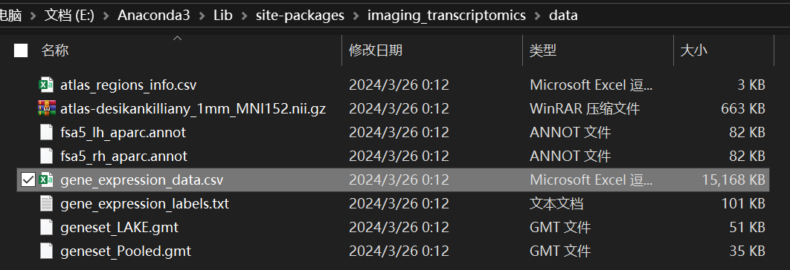

# 人脑成像转录组学（Imaging Transcriptomic）分析实践

## 1. 前言
承接上一篇笔记，记录分析的过程。主要是根据上文提到的综述中Table 1推荐的软件包进行尝试。


研究设计方面，主要参照：[Association between gene expression and altered resting-state functional networks in type 2 diabetes](https://www.frontiersin.org/articles/10.3389/fnagi.2023.1290231/full)

### 需要明确的知识

**Space, Template, Atlas**：学习了这个视频（[几个MRI的概念：Space，Template, Atlas](https://www.bilibili.com/video/BV1zv411A74x/?spm_id_from=333.999.0.0&vd_source=262636e26b325960a8c21f8bb6b74f08)）。个人的理解：Space是为了统一坐标系，比如VBM汇报有统计差异的cluster，会用坐标表示cluster的中心，一般都是MNI空间中的坐标。surface的常见标准空间有fsaverage；Template是为了统一大脑的形状，比如常用的MNI152_2009c（以volume空间为例，是否可以理解为，让个体的每一个voxel的位置都对应到标准模板中一个voxel的位置？（不考虑重采样的情况下））；Atlas和Parcellations是一个概念（Parcellations似乎在这里更加常见），比如有在MNI空间中的AAL模板，就表示了哪些坐标位置可以被归为哪个脑区。但我其实还是不能完全分辨这三者的区别，比如用SPM做VBM得到的结果，就可以查看cluster是属于哪个脑区，那这是用的哪个atlas呢？

## 2. 获取脑区-基因表达矩阵

### abagen

官方文档：[abagen: A toolbox for the Allen Brain Atlas genetics data](https://abagen.readthedocs.io/en/stable/)

abagen是众多影像转录组学工具包的基础之一。用AHBA可以获得region×gene的矩阵。由于默认的是Desikan-Killiany atlas，先尝试的就是用默认的DK图谱完成后续分析。

参照User guide，推荐的是将abagen作为python library使用。

#### 安装

```python
pip install abagen
```

#### 下载并检查原始数据

我预先创建了本地路径`F:\Public_dataset\AHBA`。

```python
import abagen

## 1. The Allen Human Brain Atlas dataset ##
# download and fetching the AHBA data to F:\Public_dataset\AHBA
files = abagen.fetch_microarray(data_dir=r'F:\Public_dataset\AHBA', donors='all', verbose=1)

# loading the AHBA data
# this can check the donors and the samples
print(files.keys())
print(sorted(files['9861']))
data = files['9861']
annotation = abagen.io.read_annotation(data['annotation'])
print(annotation)
```

#### 查看Atlas

需要指定一个atlas变量。这里只是根据User guide查看一下自带的atlas，可以根据`print(atlas['image'])`和`print(atlas['info'])`的输出找到图谱和对应的标签文件，可以复制一份用于后续的分析（比如用这个模板提取MRI的对应数据）。

```python
## 2. Defining a parcellation ##
# parcellation means 'atlas'
# in abagen:
#   (1) a NIFTI image in MNI space
#   (2) a tuple of GIFTI images in fsaverage space (and with fsaverage5 resolution!)

# for demonstration purposes: Desikan-Killiany atlas
atlas = abagen.fetch_desikan_killiany()
print(atlas['image'])
print(atlas['info'])

# or the surface version
atlas = abagen.fetch_desikan_killiany(surface=True)
print(atlas['image'])

# or individualized atlas (in donor-native space)
atlas = abagen.fetch_desikan_killiany(native=True)
print(atlas['image'].keys())
print(atlas['image']['9861'])

# and the surface verison of individualized atlas
atlas = abagen.fetch_desikan_killiany(native=True, surface=True)
print(atlas['image'].keys())
print(atlas['image']['9861'])

# non-standard atlas
# check atlas (when define custom atlas?)
# atlas = abagen.images.check_atlas(atlas['image'], atlas['info'])
```

#### 根据Atlas得到各脑区的基因表达数据

因为第一步将原始数据下载到了`F:\Public_dataset\AHBA`中，这里就相应地设置`data_dir`参数。这一步大概会消耗几分钟的时间。

```python
## 3. Parcellating expression data ##
expression = abagen.get_expression_data(atlas['image'], atlas['info'], data_dir=r'F:\Public_dataset\AHBA')
print(expression)

# if using the default command, there will be two missing rows (right frontal pole (label 72) and right temporal pole (label 73))
print(expression.loc[[72, 73]])

# 2 ways to get dense expression data
expression = abagen.get_expression_data(atlas['image'], atlas['info'], data_dir=r'F:\Public_dataset\AHBA',
                                        missing='centroids')

expression = abagen.get_expression_data(atlas['image'], atlas['info'], data_dir=r'F:\Public_dataset\AHBA',
                                        missing='interpolate')

# save the expression data to csv file
expression.to_csv(r'F:\Public_dataset\AHBA\expression.csv')
```

这里只展示了最简单的得到基因表达矩阵的方法，所有参数都采用默认值。可以检查保存的.csv文件。第一列label就是选择的atlas的各个分区，后面所有列都是不同基因的表达数据。


值得注意的是，右脑的两个脑区会缺失数据，User guide中介绍了处理方法，上文给出了其中两种填补的方法，这也是一些研究只选择左半球进行分析的原因。其它参数的设置也请参考abagen的User guide。

## 3. 结合影像数据进行分析

### Imaging-transcriptomics （[Imaging-transcriptomics](https://github.com/alegiac95/Imaging-transcriptomics)）


**使用之前的注意事项：**
- **<font color=red>尽量不要在Windows系统上使用（无法进行GSEA）</font>**，直到这个issue（[How to debug “the process cannot access it” when running imt_gsea ?](https://github.com/alegiac95/Imaging-transcriptomics/issues/18)）得到解决。
- [官方文档](https://imaging-transcriptomics.readthedocs.io/en/v.1.1.8/index.html)中也说明了pyhton 3.9+中使用会出现一些问题。实测是不能在python 3.10上顺利安装的。主要问题是其中一个依赖的包h5py在python 3.10上安装会出现问题（[issue #1996](https://github.com/h5py/h5py/issues/1996)）。实测在python 3.9.7上可以正常安装和使用。
- 我在WSL2上使用依然有一些问题，可能与WSL2有关。类似和使用过程中出现的内存不够有关。例如在用偏最小二乘回归（PLS）时设置太多成分、GSEA分析过程中，遇到了各种报错导致进程结束。
  
#### 使用Imaging-transcriptomics的命令行（Script usage）进行PLS分析

##### 脑区-基因表达矩阵

Imaging-transcriptomics自带的矩阵在包的`data`文件夹中。里面包含了DK atlas左半球的基因表达矩阵。还未尝试使用Imaging-transcriptomics分析全脑的基因表达矩阵（或者是其它atlas），因为默认的代码中有数值41和34分别指定了全脑和皮层的脑区数目，用其它atlas要修改一些代码。最简单的使用自己得到的矩阵的方法就是将上一步得到的`expression.csv`中的数据替换到`gene_expression_data.csv`中。



##### 影像数据

由于我尝试的是默认的全脑ROI，按照文档要求，我准备的是`.txt`文件，每行按顺序是每个脑区的某个影像指标，一共41行。


##### PLS分析

`imagingtranscriptomics --input /mnt/e/Neuroimage/BIDS_TestDataSet/derivatives/freesurfer/mean_values_no_header.txt pls --ncomp 1`

由于我没有指定输出文件夹，默认会在`.txt`的所在文件夹创建输出文件夹。其中`pls_component_1.tsv`是第一个主成分的结果（由于我只设置了一个成分，否则会有_2.tsv，_3.tsv等文件），`pls_analysis.pkl`是该软件包进行后续GSEA使用的数据。检查`pls_component_1.tsv`，结果如下：


是所有基因的排序结果。

## 4. GSEA

### Imaging-transcriptomics

### R

之前没有接触过生信相关的分析，这里主要参照这一篇知乎文章（[超详细的R中进行GSEA分析的流程！一看就会！](https://zhuanlan.zhihu.com/p/677845933)）用R进行分析（前面已经提到了Imaging-transcriptomics的诸多问题）。输入文件就是上一步得到的`pls_component_*.tsv`文件。

```R
#安装分析所需R包
library(ReactomePA)
#加载所需R包
library(tidyverse)
library(data.table)
library(org.Hs.eg.db)
library(clusterProfiler)
library(biomaRt)
library(enrichplot)

genelist_input <- read.table('./data/test/pls_component_3.tsv', header = T, sep = '\t')

genename <- as.character(genelist_input[,1])   #提取第一列基因名

gene_map <- select(org.Hs.eg.db, keys=genename, keytype="SYMBOL", columns=c("ENTREZID"))  #将SYMBOL格式的ID换成ENTREZ格式的ID。

non_duplicates_idx <- which(duplicated(gene_map$SYMBOL) == FALSE)
gene_map <- gene_map[non_duplicates_idx, ]   
#去除重复值
colnames(gene_map)[1]<-"Gene"

temp <- inner_join(gene_map,genelist_input,by = "Gene")
temp <- temp[,-1]
temp <- na.omit(temp)
temp$Z.score<-sort(temp$Z.score,decreasing = T)

geneList = temp[,2]
names(geneList) = as.character(temp[,1])

Go_gseresult <- gseGO(geneList, 'org.Hs.eg.db', keyType = "ENTREZID", ont="BP", pvalueCutoff=0.05)
#使用GSEA进行GO富集分析（'org.Hs.eg.db'：对应物种的数据库；ont：选择输出条目，可选“BP,MF,CC或者ALL”，pvalueCutoff：设置P的阈值）

#保存富集分析结果
go_results<-as.data.frame(Go_gseresult)

write.csv (go_results, file ="./data/test/Go_gseresult_3.csv")

gseaplot2(Go_gseresult, 1, title = "Test", pvalue_table = FALSE)
```

## 5. Spatial null models

这里需要解决的问题是**空间自相关（spatial autocorrelation, SA）**。SA也是一个很多领域中适用的概念，在这里，我是这样理解的：不论影像数据还是基因数据，都是有SA的，即距离相近的脑区的各类数据应该都是相近的（又或者说因为都是在大脑中的数据，即使是不同种类的数据也不是互相独立的）。假设我想分析的是这些脑区某个基因表达的程度和某个影像指标的关系，而两种不同“模态”的指标都是具有SA的，就导致分析得到的相关性包含了SA的部分，也包含了二者相互作用的相关性，后者才是真正想要分析的。

SA增加了假阳性率。校正的方法是对其中一种数据（这里一般是影像数据，因为只有一列？）进行变换，保留其SA的部分，而尽可能去掉其它的“内在属性”，再次进行统计分析。如果用这些模拟得到的数据得到的结果都很显著，就说明所发现的相关性可能主要是由SA引起的。

这里主要参考文献[Generative modeling of brain maps with spatial autocorrelation](https://linkinghub.elsevier.com/retrieve/pii/S1053811920305243)，文章中的分析流程和我这次尝试的相似，也是PLS+GSEA。里面介绍了考虑了SA后校正*p*值的一种非参数方法：现在用实际的临床数据分析得到了每个基因组的GSEA结果，同时假设有*N*个模拟的影像数据，这些模拟的影像数据（这篇文章中称为surrogate map）都分别进行同样的分析。对某一个基因组而言，得到的1000个GSEA的结果中，有*M*个比用实际数据得到的结果更显著，那么估计的p值就为*M*/*N*（感性认识：因为如果*M*越大，就说明保留了SA的数据反而显著的结果更多，这种相关性更可能由SA导致）。后面还提到了一个需要根据模拟次数校正的情况，但我的统计知识不支持我完全理解。**Fig 8D**中展示了这种校正方法。


### Neuromaps（[Neuromaps](https://netneurolab.github.io/neuromaps/index.html)）

需要注意的是，Neuromaps是整合了各个包的算法，包括[BrainSMASH](https://brainsmash.readthedocs.io/en/latest/index.html)、[BrainSpace](https://brainspace.readthedocs.io/en/latest/)等来进行null models的生成。分成Surface和Volume空间和是否根据atlas/parcellation进行了分割分别介绍。

#### Surface data

因为surface的数据可以膨胀成球体，只需要旋转就能在保证空间自相关的同时生成模拟数据。但具体选择哪些方法也有一些不同。

#### Volume data

##### Whole brain volume

文档中提到了对volume数据的模拟数据对计算空间的要求非常大。例如会出现下面的报错提示空间不够。原因似乎是对于volume数据，目前的算法需要计算每两个体素之间的距离，这个完全是指数增长的数据。

```python
nulls = nulls.burt2020(neurosynth_mni152, atlas='MNI152', density='1mm',
                       n_perm=100, seed=123)
Traceback (most recent call last):
  File "E:\Anaconda3\lib\site-packages\IPython\core\interactiveshell.py", line 3444, in run_code
    exec(code_obj, self.user_global_ns, self.user_ns)
  File "<ipython-input-7-1f88a5e58bab>", line 1, in <module>
    nulls = nulls.burt2020(neurosynth_mni152, atlas='MNI152', density='1mm',
  File "E:\Anaconda3\lib\site-packages\neuromaps\nulls\nulls.py", line 655, in burt2020
    return _make_surrogates(data, 'burt2020', atlas=atlas, density=density,
  File "E:\Anaconda3\lib\site-packages\neuromaps\nulls\nulls.py", line 536, in _make_surrogates
    for hdata, hdist, hind, hsl in genfunc(data, atlas, density,
  File "E:\Anaconda3\lib\site-packages\neuromaps\nulls\nulls.py", line 494, in _vol_surrogates
    dist = np.memmap(distout, mode='w+', dtype='float32',
  File "E:\Anaconda3\lib\site-packages\numpy\core\memmap.py", line 255, in __new__
    fid.flush()
  File "E:\Anaconda3\lib\tempfile.py", line 474, in func_wrapper
    return func(*args, **kwargs)
OSError: [Errno 28] No space left on device
```

我又用BrainSMASH尝试看一下中间的数据有多大。

```python
from brainsmash.workbench.geo import volume

coord_file = "E:\Codes\AHBA\data\voxel_coordinates.txt"
output_dir = "E:\Codes\AHBA\data"

filenames = volume(coord_file, output_dir)
```


选择了大概几百万个体素（1mm的T1图像+GM mask），生成的distmat.npy文件有1T多。分析实在是不太方便，没有继续做了。可以参考neuromaps中的相关issue（[How to generate a null model in MNI152 space through burt2020](https://github.com/netneurolab/neuromaps/issues/119)，[Issues with plotting neuromaps output and with higher resolution images](https://github.com/netneurolab/neuromaps/issues/154)。neuromaps团队提到了：2mm的分辨率对于volume的null models已经很高了，如果输入分割的volume数据就不会提示空间不够，但是耗时会很长（没太懂这里是为什么））。

##### Parcellated data

以AAL atlas为例

```python
from neuromaps.images import load_nifti
from neuromaps.parcellate import Parcellater
from neuromaps import nulls
from nilearn.datasets import fetch_atlas_aal

qsm = load_nifti(r'E:\Neuroimage\QSM_test\HC45\HC45_mni_qsm_smooth_3mm.nii')

aal_vol = fetch_atlas_aal()
parcellation_mni = aal_vol['maps']
parcellater_mni = Parcellater(aal_vol['maps'], 'mni152')

qsm_parc = parcellater_mni.fit_transform(qsm, space='mni152')

nulls = nulls.burt2020(qsm_parc, atlas='MNI152', density='2mm',
                       n_perm=10, seed=1234, parcellation=parcellation_mni)

print(nulls.shape)
```

```
(116, 10)
```

查看nulls，由于设置n_perm=10，生成的就是10组模拟的数据，每个包含116个脑区的值。

