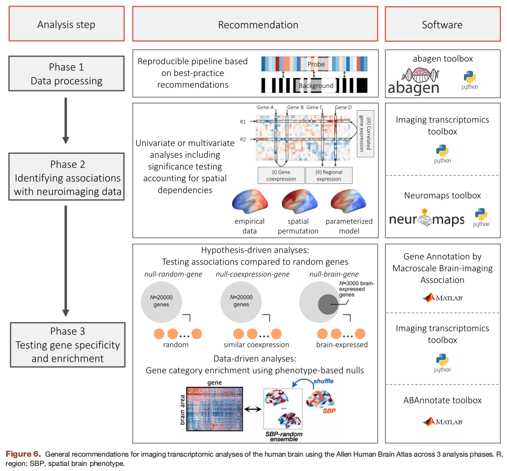

# 人脑成像转录组学（Imaging Transcriptomics）学习

参考此综述：[Toward Best Practices for Imaging Transcriptomics of the Human Brain](https://linkinghub.elsevier.com/retrieve/pii/S0006322322017103)

根据综述中的大标题，这一类的研究可以分为以下**三个部分**，分别进行介绍。相应的，选择的工具包也是根据文献中图6的推荐

## PHASE 1: PROCESSING TRANSCRIPTIONAL ATLAS DATA
这一部分在作者之前的另一篇综述中进行了详细介绍：[A practical guide to linking brain-wide gene expression and neuroimaging data](https://linkinghub.elsevier.com/retrieve/pii/S1053811919300114)

## PHASE 2: RELATING EXPRESSION AND NEUROIMAGING MEASURES
这里提到的三种分析方法是我觉得最难理解的

### CGE
### GCE
### RGE

## PHASE 3: EVALUATING GENE SPECIFICITY AND ENRICHMENT