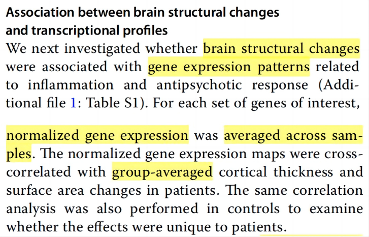

# 人脑成像转录组学（Imaging Transcriptomics）学习

参考此综述：[Toward Best Practices for Imaging Transcriptomics of the Human Brain](https://linkinghub.elsevier.com/retrieve/pii/S0006322322017103)

根据综述中的大标题，这一类的研究可以分为以下**三个部分**，分别进行介绍。相应的，选择的工具包也是根据文献中图6的推荐。

我认为这篇综述中介绍的三个研究步骤中，第二个步骤是最重要的，因为PHASE 1和PHASE 3不只是适用于神经影像数据，是研究基因表达和其他样本数据时也会面临的问题。而**PHASE 2**是针对神经影像数据。

---

## PHASE 1: PROCESSING TRANSCRIPTIONAL ATLAS DATA
这一部分在作者之前的另一篇综述中进行了详细介绍：[A practical guide to linking brain-wide gene expression and neuroimaging data](https://linkinghub.elsevier.com/retrieve/pii/S1053811919300114)

总之，这一步最后可以生成一个**region-by-gene expression matrix**

---

## PHASE 2: RELATING EXPRESSION AND NEUROIMAGING MEASURES
文献中提到了三种分析方法，提供了不同的研究方向

### 1. GCE（基因共表达，Gene Coexpression）
从region-by-gene矩阵得到gene-by-gene矩阵（分析每对基因在各个region的表达是否具有相关性）

但是因为多重比较的原因，一般会用 **weighted gene coexpression network analysis (WGCNA，加权基因共表达网络分析)** 的方法进行分析。这种方法在生信中常用，分析基因表达和其他样本性状。我之前没有了解过这种方法，但是个人认为这种分析方法对于器质性疾病的意义不大。

WGCNA的基本思想就是对gene-by-gene矩阵进行聚类以降维，这样可以大幅减少多重比较的次数。得到了gene-by-gene矩阵后，计算Topological Overlap Matrix (TOM)这种邻近矩阵，再用层次聚类 (Hierarchical Clustering)生成基因的聚类树 (dendrogram)，然后用dynamic tree cut进行聚类（在这里一般称为“模块 (module)”）。由于每个模块包含多个基因，每个模块再通过奇异值分解计算一个特征值 (eigengene)，用于后续和其他样本数据进行统计分析。

以这篇文章为例[Cell-Type-Specific Gene Modules Related to the Regional Homogeneity of Spontaneous Brain Activity and Their Associations With Common Brain Disorders](https://www.frontiersin.org/articles/10.3389/fnins.2021.639527/full)，这里只探讨其前半部分（后半部分进行富集分析，是PHASE 3的内容）

**选择的区域：** 284个新皮质区域
**选择的基因：** 通过WGCNA得到的30个模块
**选择的影像指标：** ReHo (zReHo)。所有被试的ReHo值求平均

也就是说，影像数据是一个284×1的zReHo值（因为要对被试求平均），基因数据是30个284×1的eigengene值（因为有30个模块）

这篇文章WGCNA的结果主要在图2中（文章还用到了3个不同的数据集）。对30个模块，每个模块都和zReHo数据进行相关性分析。

这样就发现，zReHo这种指标在新皮质区域的分布，和特定的基因表达模式是相关的。

### 2. RGE（区域基因表达，Regional Gene Expression）
选定一些基因或基因组，然后和影像数据一起分析

以这篇文章为例[Transcriptional level of inflammation markers associates with short-term brain structural changes in first-episode schizophrenia](https://bmcmedicine.biomedcentral.com/articles/10.1186/s12916-023-02963-y)

**选择的区域：** 34个皮层区域
**选择的基因：** (1) 炎症相关基因（各白细胞亚型，根据两篇既往综述以减小偏倚）；(2) 与抗精神病药物治疗反应有关的基因（根据GWAS研究）
**选择的影像指标：** 皮层厚度和表面积的变化（因为是纵向研究）。需要对所有被试求平均

先看文章得到的结果（文献图3）

发现在SZ人群中，厚度变化和单核细胞基因的表达有关。具体看图(B)的第一幅（下方HC的图肉眼只能分辨出明显的32个数据点，不清楚为什么少2个），横坐标是厚度变化，纵坐标是基因表达，一共34个数据点，每一个数据点代表了1个皮层区域。

也有用 **偏最小二乘（PLS）** 的方法分析加权的基因表达（不太理解？）

### 3. CGE（相关基因表达，Correlated Gene Expression）
这种方法可以和第一种GCE相比，从region-by-gene矩阵得到region-by-region矩阵（分析各个区域之间的基因表达相关性）。个人认为这种方法似乎也不太适合器质性病变的神经影像数据。

以这篇文章为例[Genetic influences on hub connectivity of the human connectome](https://www.nature.com/articles/s41467-021-24306-2)，分析了人脑纤维连接的相关基因表达

**选择的区域：** 180个（左半球）
**选择的基因：** 全部基因（AHBA预处理得到的10027个基因）
**选择的影像指标：** DWI计算的纤维连接

基因表达相关的区域之间，纤维连接也多

总的来说，我认为对于神经疾病来说，第二种方法（RGE）的临床意义是最大的，并且也是使用最多的。而第一种和第三种基本上是使用了全部的基因和影像数据，更适合探索性研究（比如GCE可以研究某些影像指标是否和特定基因模块的表达有关，CGE可以研究人脑各个区域之间的联系是否和基因在各区域之间的表达有关），往往是普适而不是针对某种疾病的，发表的文章的上限也是最高的，例如上面CGE举例的Nature Communications上的文章和发表在Science上的[BRAIN NETWORKS. Correlated gene expression supports synchronous activity in brain networks](https://www.science.org/doi/10.1126/science.1255905)（但这篇文章在pubpeer似乎有些争议）。

对于RGE，这里再分享两篇对神经疾病的研究。

- [Combined Connectomics,  <i>MAPT</i>  Gene Expression, and Amyloid Deposition to Explain Regional Tau Deposition in Alzheimer Disease](https://onlinelibrary.wiley.com/doi/10.1002/ana.26818)：淀粉样蛋白表达高的区域，MAPT基因的表达也高
- [Association of <i>RNF213</i> Variants With Periventricular Anastomosis in Moyamoya Disease](https://www.ahajournals.org/doi/10.1161/STROKEAHA.121.038066)：RNF213基因在侧脑室周围表达高，可能和烟雾病中侧脑室周围血管吻合的发生相关。这篇文章中没有和影像数据做相关，因为有每个病人的RNF213基因数据，结合烟雾病的评分进行了统计分析。

我觉得另外值得关注的是，这里介绍的一共三种使用类似RGE的研究，使用的AHBA数据都只是研究的一部分。还需要其他的数据分析印证临床假设，单独使用AHBA数据和神经影像数据做相关分析可能力度不足。

#### 空间自相关（spatial autocorrelation）
空间相近的区域各个指标的相关性会较高，因此增加了统计分析假阳性的概率。

处理空间自相关的方法：
-  **model and remove the spatial dependence of the data：** 使用CGE时比较适用（region-by-region）
-  **spatially constrained null models：**
    - spatial permutation models & naive models：这两种都是非参数模型（nonparametric spatial permutation models），和下一种参数化模型相对。这种方法主要适用皮层数据，因为大脑皮层在这种方法中可以看成是球形，可以通过简单的旋转变化使得位置发生变化而距离依赖（distance-dependence）的特征不受到影响。因此，spatial permutation models的优势在于可以保留距离依赖的相关性，但缺点是不能用于皮层下的数据，另外由于内壁（medial wall）被旋转到了皮层，会产生缺失值（这里也不太理解）。这种方式的统估计相比非参数法更加保守。
    - parameterized data models：根据数据的空间自相关性，生成新的数据，基本保留了空间自相关性但随机化了形态特征（topography）

---

## PHASE 3: EVALUATING GENE SPECIFICITY AND ENRICHMENT
这里作者分成两种研究类型进行了介绍

### Hypothesis-driven（假设驱动）
这种研究需要说明的问题是：例如，根据假设，一个（或一组）基因可能和某种影像指标的分布有关，因此进行了相关性分析并证明了二者的相关性（指标高的区域，基因表达也高），临床意义在于验证了基因作为潜在机制。但有可能其他很多基因也和这种影像指标是相关的。

作者提到了这篇文章[Statistical testing in transcriptomic-neuroimaging studies: A how-to and evaluation of methods assessing spatial and gene specificity](https://onlinelibrary.wiley.com/doi/full/10.1002/hbm.25711)，详细介绍了gene specificity对结果的影响（还没有细看）。总是，spatial autocorrelation和gene specificity都是需要考虑的问题，否则假阳性率高。

上面介绍过的这篇文章[Combined Connectomics,  <i>MAPT</i>  Gene Expression, and Amyloid Deposition to Explain Regional Tau Deposition in Alzheimer Disease](https://onlinelibrary.wiley.com/doi/10.1002/ana.26818)，好像就考虑了gene specificity的问题。正文第7页中就说明了虽然该研究是MAPT基因假设驱动的研究，但也计算了所有基因和蛋白样蛋白SUVR的相关性，发现MAPT和淀粉样蛋白SUVR的相关性值（correlation scores）是靠前的，在另一亚组中同样如此。

### Data-driven（数据驱动）
在数据驱动的研究中，得到了一组基因和影像数据相关，那么就会去印证是否是特定功能的一类基因和影像指标相关（因为数据驱动的聚类/模块还没有得到有意义的解释）。

可以使用 gene category enrichment analyses (GCEAs) 的方法。即已经得到的基因功能标注，如GO、KEGG。