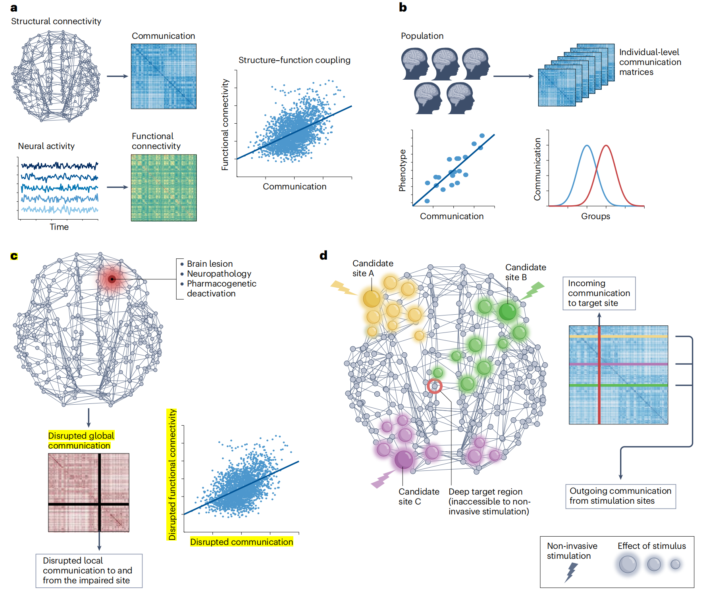

Brain Network Communication
=============================

参考综述：[Brain network communication: concepts, models and applications](https://www.nature.com/articles/s41583-023-00718-5)

写在前面：最近才开始认真看脑网络相关的文献。之前零零散散学过一些脑网络的知识，但不太理解其中的原因（为什么要选择这些指标？为什么要进行这些分析？）。最近陆续看了一些脑网络相关的综述，我觉得很重要的一点是，需要理解**网络神经科学（Network Neuroscience）** 其实也是网络科学的一部分，但是又兼具了一些特别的性质。本身网络科学在经济、社交、生态系统等领域是有很广泛应用的。换句话说，通过综述去了解脑网络的建模的历史，以及其能解决的问题，对脑网络在临床研究中的应用是很有意义的。

这篇综述主要从脑网络通信的角度进行分析。这篇文章条理很清晰，我这种初学者也能大致理解其中含义，并且并不涉及很难的数学推导，但又能通过描述给读者建立符合知觉的印象，让我受益匪浅。

## 背景 & 从图论到脑网络通信
主要讨论的是结构网络（connectome）和功能网络。要探索的问题：neural communication，神经信号是如何在大脑中传播的？比较经典的问题就是如何解释**在解剖无关的区域能观察到功能的相关性**（让我想起来之前问过黄晓琦老师结构网络和功能网络的区别，其实就是我先入为主的认为神经信号就是完全按照结构网络传播）。

比较早期的研究：发现了脑网络的**小世界属性**，基于**图论（Graph Theory）** 计算指标。但这些指标都是基于**shortest path assumption**，即两个节点间信息的传导只沿**最短路径**（在后面的部分会详述）。但这样的假设和脑的实际情况有差距，主要体现在脑网络是decentralized systems，一个节点不可能拥有网络的完整信息，也就不可能只选择最短路径传到另一节点。

这也就引出了本文的3个网络通信模型和3个建模时考量的基本指标。

## 脑网络通信模型分类

**3个基本考量的指标（cost）**
- **delay cost**：信号传递的效率/速度（例如通过越长的路径传递，效率/速度就越慢）
- **informational cost**：信号传递需要的信息（例如前面提到的，选择最短路径传播就要求每个节点都掌握全部网络信息）
- **energetic cost**：信号传递需要的能量（例如尝试多条路径比只选择一条路径耗能更多）

这3个指标只是比较基本的考量，但并不是完整的考量，另外的有意义的指标如信号传递过程中的损失。理想的脑网络通信模型应当是很好地平衡了各方面的cost。

**3类脑网络通信模型**

### Routing Protocols
选择一条特定的路径
- Shortest path routing
  如前所述，两个节点之间的路径选择所有路径中最短的路径。但在脑网络中难以实现
- Navigation
  "greedy routing"：每一步都选择与终点最近的节点，所以是贪心的。最常用欧氏距离，新研究有沿皮层梯度进行路径寻找的（“梯度”也是我一直没有理解的概念）。有可能出现陷入循环而找不到完整路径的情况，但在脑网络这种复杂网络中基本不会出现这种问题。在各种生物中找到的路径基本有最短路径的70-100%。这也引出efficiency ratio这个指标，为shortest path/navigation path

delay cost：低  
informational cost：很高  
energetic cost：低 

### Diffusion Process
Diffusion Process和第一种Routing Protocols正好相反。每一个节点只拥有少量信息，但需要尝试很多路径
- (Unbiased) random walks
  根据节点之间连接的权重，从一个节点出发会以相应加权的概率游走到其中一个相邻节点，直到最终到达终点。引出指标：first passage time：随机游走需要的平均步数；diffusion efficiency：前者的倒数
- Broadcasting (communicability)
  文章中介绍了一种简单的broadcasting策略：对于两个节点之间的传播，首先考虑从起始点距离为1的传播，然后以这些能被传播到的节点再传递到他们的相邻节点（距离为2的传播），依次刻画出长度为$\infty$的两个节点之间的路径（因为考虑了已经传播到的节点可能再次被传播）。引出communicability这个指标（即使对模型的称呼，也是一个指标，仅次于shortest path常用）：这些所有路径的加权和，权重为1/n!（保证较长的路径贡献非常小）。高的communicability表示节点之间的路径效率比较高，可以理解为通信的**韧性（resilience）** 或是平行传递信号的能力

另外在文章Box 2中提到的几个指标：search information：使两个节点随机游走路径转变为最短路径需要的信息量；path transitivity：local detours（不是两个节点间的最短路径，但是是朝着目标方向的路径，这些路径相当于可以使偏离最短路径的信号回到最短路径上）的密度；resource efficiency：在给定概率下，至少有一个信号通过随机游走成功到达目标节点需要的信号数量

delay cost：低（因为总会游走到一条路径是全局最短路径）  
informational cost：低  
energetic cost：很高（因为要尝试各种路径）  

### Parametric Models
符合直觉的是，Routing Protocols和Diffusion Process是两个极端，分别是节点完全知晓全局网络的结构和节点只知晓自身相邻节点的结构。那么，Parametric Models就是通过设置一些参数，达到各个cost之间的平衡，这也许会更接近真实的脑网络
- Linear threshold model
  考虑对节点施加一个扰动，每个节点有“激活”和“未激活”两种状态，激活就表示信号（这里是扰动）传递到了该节点。参数为$\theta \in [0,1]$，规定了每个节点需要多少比例的相邻节点被激活，该节点才被激活。$\theta = 0$时，施加到节点的扰动一定会传遍整个网络，$\theta = \theta_c$是施加到节点的扰动能传遍整个网络的最大值，$\theta_c$也是一般研究中考虑的情况。和前面提到的communicability不同，该模型不会考虑已经被激活的节点被再次激活。因此，Linear Threshold Model有中等的energetic cost，基本属于介于Diffusion Process和Routing Protocols之间的模型
- Biased random walks
  这个模型可以理解为介于Random Walks和Routing Protocols之间的模型。(Unbiased) random walks限制节点只掌握自身的结构信息，Routing Protocols则假设节点掌握全局信息。那么，引入参数$\lambda$控制节点掌握信息的数量，$\lambda = 0$就是随机游走，$\lambda \rightarrow \infty$就是最短路径
- Shortest path ensembles
  这个模型引入参数$k$规定信号通过前多少个最短路径进行传播。相较于最短路径，该模型在较多保留了低delay cost的同时降低了informational cost但提高了energetic cost

Box 3中另外提到的指标：k-shortest path length；k-edge disjoint paths：节点之间不共用连接的路径数量，也能反映通信网络的**韧性**

## 现在和未来的应用

### 连接脑结构和功能
这也是通信模型最早、最基础的应用领域。例如最开始提到的经典问题：结构相关的区域功能也相关，但研究进一步发现，结构不直接相关的区域也会有功能上的相关。后续的研究通过建立通信模型，解释了为什么这些解剖无关的区域也有功能的相关，但大多数这方面的研究对功能的刻画都是通过rs-fMRI，可能不如任务态的fMRI更有说服力。

但总的来说，这方面应用探究的是正常状态下结构和功能的关系。
### 探索个体间的差异
探究某些指标和前面提到的脑网络通信指标的关系。也是临床研究比较常见的方法，例如AD病人中某个脑网络通信指标是否和认知功能相关；AD患者和健康人群相比是否有某些脑网络通信指标的差异。

### 对病灶影响和病理状态传播建模
额外关注这一点，因为对自己的研究方向有较大参考价值。

文章介绍了[Grayson et al.](https://www.sciencedirect.com/science/article/pii/S0896627316302586)的研究，其核心是表达对某个结构的破坏（该研究中是杏仁核）会影响到没有直接解剖联系的区域。因为涉及到具体区域的受损，这方面的研究是典型的神经影像领域，包括ALS、AD、PD、卒中等，反而在精神疾病方面应用较少。

**应用价值在于：已知某个区域的受损，希望通过通信模型，可以预测有哪些区域会受到影响，进而对病人的预后进行预测。**
### 对刺激传播建模
对临床研究的价值主要在于预测对特定区域实施电刺激的**治疗效果**，例如癫痫。和前一种类似，也是希望阐明causal effect，只是前者是病灶的影响，这里是人为干预的影响。

## 前景和推荐
文章最后主要是对脑网络通信模型的各个方面进行总结，这里结合自己的见解简要叙述。

脑网络通信模型的2个关键优势：（1）可以比较直观的解释结构连接在大脑信号传导中的意义（我的感受是，这篇综述里介绍的模型都是符合数学直觉，容易体会的）；（2）可以进行定量计算，且对计算资源的要求不高。

但最主要的缺点是：仍然距离真正的神经信号传导机制很远（个人理解为，这也是MRI研究的弊病，本身的尺度就受限，完全无法和基础研究相比。另一方面，这些模型的假设和真实的传导机制也不一致，比如没有考虑信号的失真、真实的传导可能同时采用了多种策略）。

基于前面提到的优势和不足，文章给出的实践推荐：（1）尝试多种模型，即hybrid（不是result hunting的意思，而是找到最贴切所研究问题的模型）；（2）干预性和纵向研究提供的数据比较好。因为"communication"本身就是一个动态的过程，其应用价值相应地也更倾向于预测某一个节点的变化如何影响其他的节点。