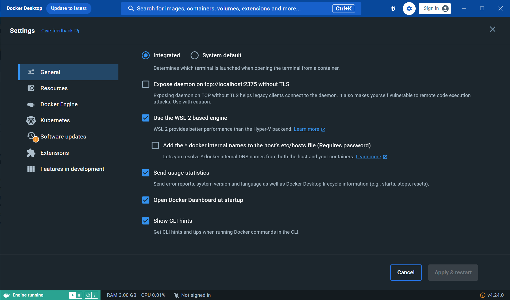
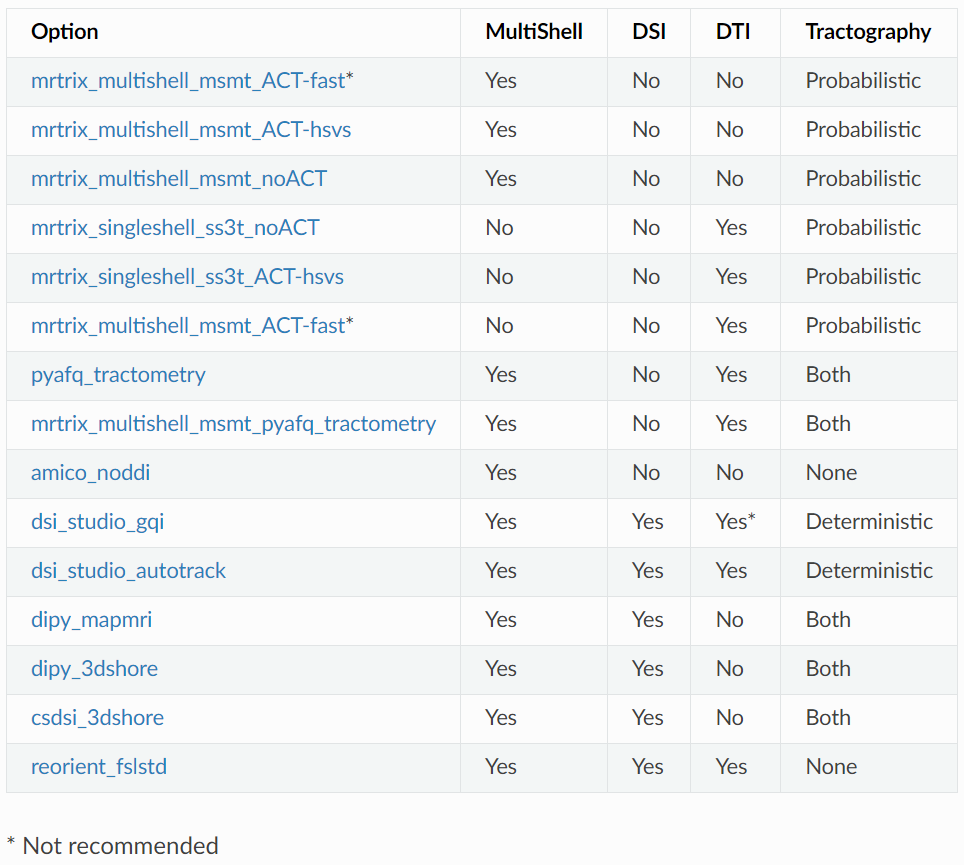
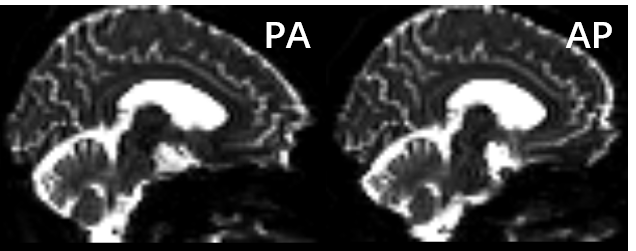
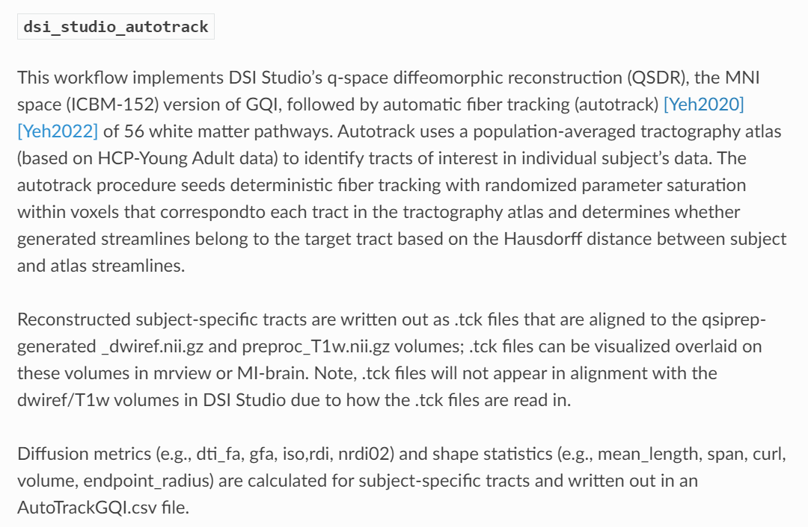
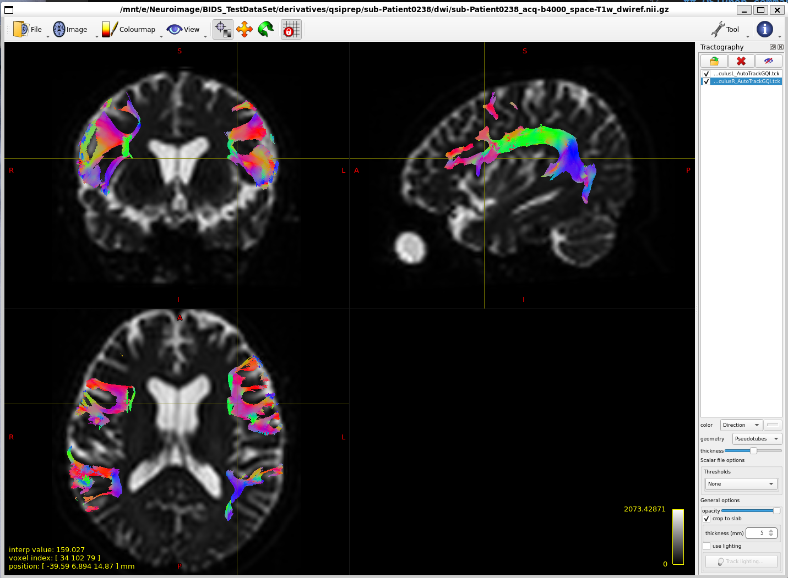

QSIPrep使用过程记录
====================
环境：Windows 10 + Docker Desktop + WSL2 Ubuntu22.04   
数据：西门子DSI（DSI_Q4-Half_b4000_S6_fast）

## 前言
正好最近在学习connectome相关的内容，阴差阳错尝试了QSIPrep，过程比想象中的顺利（因为到官方文档才知道QSIprep和ASLPrep是一个组做的，而之前尝试用ASLPrep一直没跑通）。

另外我也尝试了用MRtrix3分析DSI数据，但似乎因为不是多壳（multi-shell）的（[[ERROR]: Not classified into shells](https://community.mrtrix.org/t/error-not-classified-into-shells/4006), [Error in dwipreproc eddy](https://community.mrtrix.org/t/error-in-dwipreproc-eddy/1164)），无法用MRtrix3进行预处理（参考的教程是[MRTRIX3系列教程](https://liaopan.github.io/mrtrix/)）。归根结底还是自己对Diffusion MRI的原理不甚了解:(

## BIDS format
个人觉得QSIPrep的官方文档讲解的不是很详细。遇到的第一个问题就是反向b0文件应该放在哪个模态的文件夹中。在neurostars上查询了相关问题之后，应该是将反向b0放在`fmap`文件夹中。([Correctly structuring DWI data in BIDS](https://neurostars.org/t/correctly-structuring-dwi-data-in-bids/16506/1), [BIDS formatting of pepolar field maps for dwi](https://neurostars.org/t/bids-formatting-of-pepolar-field-maps-for-dwi/26041))。我准备了T1w，DSI和DSI b0三个数据。

另外还遇到了BIDS格式报错的问题（`‘IntendedFor’ field needs to point to an existing file.`），可能是我使用Windows + WSL2的原因。将反向b0的json文件中`"IntendedFor"`对象从dcm2bids生成的`bids::`开头的路径改为`dwi/sub-Patient0238_acq-b4000_dwi.nii.gz`后问题解决。

## QSIPrep command

### 安装
为了使WSL2 Ubuntu能够使用安装在Windows中的Docker，在Docker设置中"Use the WSL 2 based engine"

安装：`$ pip install --user --upgrade qsiprep-container`

### 运行
QSIPrep主要包括两个模块：Preprocessing和Reconstruction。Preprocessing部分我使用了默认参数。Reconstruction部分中，由于我不了解各种纤维重建方法的区别，我按照了QSIPrep给出的推荐表格选择了`dsi_studio_autotrack`。

`qsiprep-docker /mnt/e/Neuroimage/BIDS_TestDataSet /mnt/e/Neuroimage/BIDS_TestDataSet/derivatives participant --participant-label Patient0238 -w /mnt/e/Neuroimage/workdir --fs-license-file /mnt/e/Neuroimage/license.txt --output-resolution 1.2 --recon_input /mnt/e/Neuroimage/BIDS_TestDataSet/derivatives/qsiprep --recon_spec dsi_studio_autotrack --verbose --verbose --stop-on-first-crash`

这里记录一下印象中踩过的坑，但当时没有记录，可能不全：
- 设定`-w`参数和`--verbose --verbose --stop-on-first-crash`。这是因为我遇到了结果文件的可视化报告中没有图片的bug。参照了这两个issues后（[no figures included in HTML report](https://github.com/PennLINC/qsiprep/issues/378), [subject html file doesn't have any visual reports like carpet plots!!](https://github.com/PennLINC/qsiprep/issues/262)）添加了`--verbose --verbose --stop-on-first-crash`用于及时退出并打印错误信息。issues中提到的是用绝对路径设定输出文件夹，但我是在设定了`-w`后解决了这一问题（`-w`后的路径不用指定已经存在的文件夹）。
- 我的DSI序列转换为nii格式后并没有`"PhaseEncodingDirection"`，`"TotalReadoutTime"`，`"EffectiveEchoSpacing"`这几个字段，但是这几个参数是TOPUP校正中需要的。第一部BIDS格式检查虽然不会报错，但会有warning提示这几个字段是进行校正必需的。查询了相关问题后，`"PhaseEncodingDirection"`很好得到，检查不同方向的b0图像也很明显地看出AP方向额叶是凹陷的，PA方向额叶是突出的，但发现我能查到的Dicom参数似乎无法算出`"TotalReadoutTime"`，好在DSI和反方向b0序列的`"TotalReadoutTime"`应该是相同的，只用设置一个相同的值即可（[TotalReadoutTime inconsistent](https://github.com/rordenlab/dcm2niix/issues/308), [wishlist: TotalReadoutTime for sidecar BIDS .json](https://github.com/rordenlab/dcm2niix/issues/98), [Calculation of TotalReadoutTime](https://github.com/rordenlab/dcm2niix/issues/130)），于是将这几个参数添加到了dcm2bids使用的config文件中，重新转换为BIDS格式。

## 结果检查
### 可视化报告
根据我前面的设置，在指定输出文件夹下的`qsiprep`和`qsirecon`文件夹中，分别有一个`sub-Patient0238.html`文件。

### 纤维束重建结果
在结果检查这一步也踩坑了。一开始我觉得使用的是DSI studio的autotrack算法，就应该用DSI studio检查结果。但发现导入了.fib文件作为背景后再加载.tck文件显示的纤维束无法和被试的大脑对应，因此又去看qsiprep的官方文档，已经写了推荐用mrview或MI-brain检查结果。

用mrview简单检查结果如下：加载`sub-Patient0238_acq-b4000_space-T1w_dwiref.nii.gz`作为volume图像，右上角工具选择tractography，选择前两个纤维束展示（因为前面没有修改过模板，我选择的前两个是左和右的弓状束，`sub-Patient0238_acq-b4000_space-T1w_desc-preproc_bundle-ArcuateFasciculusL_AutoTrackGQI.tck`和`sub-Patient0238_acq-b4000_space-T1w_desc-preproc_bundle-ArcuateFasciculusR_AutoTrackGQI.tck`）。
