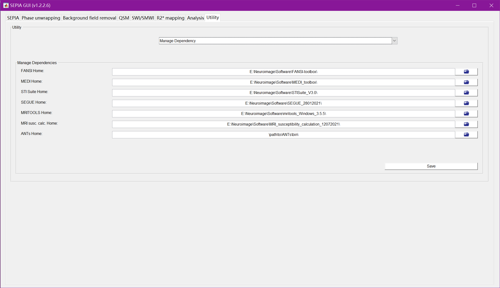

# SEPIA使用过程记录

写在前面：最开始看到SEPIA似乎是在一篇DTI ALPS的文章中提到了处理QSM使用的[SEPIA](https://sepia-documentation.readthedocs.io/en/latest/index.html)。我也用过其它的工具包，比如[STI Suite](https://chunleiliulab.github.io/software.html)和[IronSmith](https://github.com/vzachari/IronSmithQSM)，但在处理我手上GE数据的时候都遇到一点问题（前者导入nii文件时有问题，后者安装需要singularity有点麻烦，比较有意思的是提供了配准QSM图到MNI152空间的操作，但在我的数据上效果不好，不知道是为什么），自己没有办法解决。SEPIA的话使用比较方便，也包含了前两者的处理算法。

安装过程参照文档提示。**注意**：如果是Windows环境下的matlab，就没有办法指定ANTs的路径，但对后续的QSM（以及R2star mapping和SWI）处理没有影响；为了尝试Analysis模块的功能，需要一个Linux环境的matlab（我在网上搜了一些WSL2安装matlab的教程，但操作下来发现就按照一般的Linux系统的matlab安装教程和相应的软件资源就可以了）。

## QSM的基本原理
物质的磁化率$\chi$属性:
- 顺磁性物质（paramagnetism）：在外磁场作用下产生很小的磁矩，与外加磁场方向**相同**。如**脱氧血红蛋白**、**高铁血红蛋白**、**含铁血黄素**。
- 抗磁性物质（diamagnetism）：在外磁场作用下产生很小的磁矩，与外加磁场方向**相反**。如**钙化**、**氧合血红蛋白**、**铁蛋白**。
- 铁磁性物质（ferromagnetism）：在外磁场作用下迅速磁化，外磁场撤出后仍能保有磁化现象。如铁。
- 超顺磁性物质：颗粒小于一定尺寸时在外磁场存在或撤除时能迅速此话或退磁化。

血红蛋白磁性的变化对理解脑出血T1、T2信号的变化至关重要（好像一般都用口诀或者手势记忆），但对CSVD领域主要关注的还是铁沉积（铁蛋白）、钙化、CMB（含铁血黄素）。

物质自身的磁化属性对MRI成像不利的方面在于伪影干扰，但有利的方面是可以利用自身组织的磁化率不同进行显像。比如最早学习MRI原理记住的一句话：T2\*是考虑了主磁场不均匀的T2，就是利用了这一性质。T2\*后有SWI序列，SWI里静脉脱氧血红蛋白高，为顺磁性、低信号。另外，由于坐标系统的不同，GE、Philip采用右手坐标系统，相位图中出血为低信号，钙化为高信号；Siemens采用左手坐标系统，相位图中出血为高信号，钙化为低信号（参考[SWI序列原理及临床应用](https://zhuanlan.zhihu.com/p/337945551)）。

## SEPIA 101 - First QSM with SEPIA
参照官方的教学[SEPIA 101](https://sepia-documentation.readthedocs.io/en/latest/tutorial/SEPIA101/index.html)进行尝试。里面讲解了一些QSM的原理，涉及MRI的基本原理，我只能理解部分含义。

### 数据准备：

我下载的版本并没有找到教程中提到的`sepia101_data`示例数据，于是采用自己的研究数据。数据准备参照[Data Preparation](https://sepia-documentation.readthedocs.io/en/latest/getting_started/Data-preparation.html)。为了方便先尝试SEPIA自己的格式，其中需要注意的是用MRIcroGL dcm2niix GUI转换的-m参数在左下角设置。使用dcm2niix后再用fslmerge命令分别将各个echo的幅度图和相位图合成一个。（补：SEPIA也支持BIDS格式，但关于QSM序列的magnitude和phase图应该放在哪个文件夹（似乎应该放在fieldmap）、按照什么格式还不太清楚，另外用BIDS格式作为输入，SEPIA也会先转成SEPIA自己的格式，时间会长一些，需要自己取舍）

`sepia_header.mat`文件我只填入了B0和TE（根据[SEPIA header](https://sepia-documentation.readthedocs.io/en/latest/getting_started/Sepia-header.html)中说新版本只需要这两项）

**幅度图：** 可以发现，随着TE的延长，图像的信号减弱，因为质子dephasing更多。同时可以观察发现信号强度白质>皮质>深部灰质（例如苍白球），因为例如深部灰质核团铁沉积多，抗磁性产生的磁场加速了质子dephasing，信号强度更低。

**相位图：** 相位图才是QSM的关键。可以发现，随着TE的延长，图像对比度越清晰，因为$phase = frequency * time$，越长的TE导致了差距越大的相位。但这样理解是不严谨的，因为相位图的范围是$(-\pi, \pi)$，可能实际上更大的相位已经在下一周期了。因此，需要根据多个echo的信息进行phase unwrapping预处理操作（这一步也是众多QSM算法的重要区别点）。

### Phase Unwrapping

这一步大约需要1分钟。根据教程，没有找到名称对应的输出文件，推测教程中的`Sepia_unwrapped-phase.nii.gz`应该是`Sepia_part-phase_unwrapped.nii.gz`（现在可以检查各个echo，同一部位应当在越后的echo中值越大，且理应符合线性关系，线性关系的斜率就代表了各个组织磁化率的不同，也就是后面的fieldmap），`Sepia_total-field.nii.gz`应该是`Sepia_fieldmap.nii.gz`（用教程中的话说，可以发现图像的前方hidden by something，这是由于目前得到的图像是组织信息和背景信息的相加，下面一步就是去除背景的干扰）

### Background Field Removal

### Dipole Inversion
上一步得到了由组织产生的fliedmap，但仍然没有直接反映组织的磁化率。他们的关系为$Tissuefield = \chi * d$（即组织在某一处产生的磁场是其周围组织产生磁场的总和），那么就需要根据上一步得到的组织fieldmap计算得到磁化率信息，公式为$\chi = F^{-1}[\frac{F(Tissuefield)}{F(d)}]$(利用傅里叶变换，称为偶极反演，也是方法学的差异之处)。

## One-step处理

两种方式处理结果相同：

## Analysis模块

这一部分的处理是获得被试个体空间的几个atlas（将标准空间的atlas配准到个体空间）。**接下来的操作都是在Linux中的matlab中进行的**。

### 准备工作

**下载Atlas**：根据官方教程，有一个脚本用于下载图谱的信息。国内如果报错的话可以自己打开脚本，按照里面的网址下载，放在SEPIA目录下的Analysis文件夹即可。

**设置ANTs路径**：下载ANTs，按照要求设置ANTs的路径。我第一次用matlab提示有C++相关库的问题。

### 运行