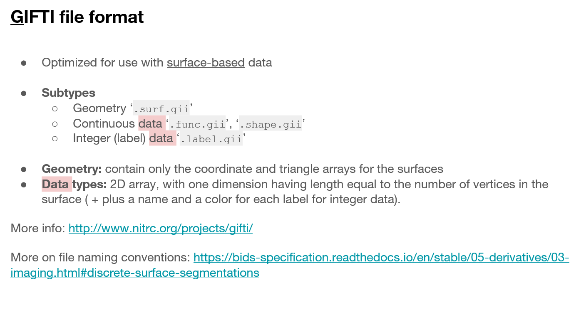

# Surface-based morphology 

因为对于Gifti/Cifti格式的表层数据不太熟悉，从头开始学习一些基于surface的分析（和可视化）。

## Connectome Workbench

一些有用的资料：
- [wb-cifti-tutorial](https://github.com/akhanf/wb-cifti-tutorial)
- [KhanLab_ConnectomeWB_tutorial_2021](https://docs.google.com/presentation/d/1aE4J3XDQ8pWLJfAehLS7NBeiLoyq4SzpgZHUf81OkvY/edit?usp=sharing)
- fsLR 32k表面的图谱/模板：[fs_LR_32](https://github.com/DiedrichsenLab/fs_LR_32)
- HCP官方文档对于常见问题的解答：[HCP Users FAQ](https://wiki.humanconnectome.org/docs/HCP%20Users%20FAQ.html)
- 一些可视化工具：[Editing .gii files](https://neurostars.org/t/editing-gii-files/2309)

上面的幻灯（第二个）对于理解cifti和gifti格式很有帮助。



需要理解的是，Gifti格式包含了

- Geometry：决定了皮层的形状，比如说顶点越多的表面就需要更多的坐标描述。
- Data：决定了每个顶点的值

比如.surf.gii就是几何信息（各种表面的位置），然后相应的.func/shape/label.gii就对应了这些顶点的属性，比如皮层厚度等等值。安装Workbench后，可以通过如下方式查看上面的描述


这里以可视化任务为例：

### 1. 可视化FreeSurfer计算的皮层厚度（从个体空间到fs_LR，以左半球为例）

**参照上面提到的FAQ的第九条里的pdf文档**。首先在github上[HCPpipelines](https://github.com/Washington-University/HCPpipelines/tree/master/global/templates/standard_mesh_atlases)下载到标准的mesh（CBIG，也就是Yeo组的github文件中也有包括）

**第一步：** 生成几何信息的转换（wb_shortcuts似乎是linux的脚本，windows下不知道可不可行，所以我在wsl中运行）。文件路径分别对应：白质表面、灰质表面（FreeSurfer 7.x版本的[问题](https://www.mail-archive.com/freesurfer@nmr.mgh.harvard.edu/msg68931.html)，我这里是lh.pial.T1）、指定的新表面（刚才下载的模板，比如这里我选择32k顶点的）、生成的代表原始midthickness的文件名、生成的代表目标midthickness的文件名、生成的代表原始sphere的文件名

```
wb_shortcuts -freesurfer-resample-prep /usr/local/freesurfer/7-dev/subjects/sub-HC01/surf/lh.white /usr/local/freesurfer/7-dev/subjects/sub-HC01/surf/lh.pial.T1 /usr/local/freesurfer/7-dev/subjects/sub-HC01/surf/lh.sphere.reg /mnt/g/CBIG-master/data/templates/surface/standard_mesh_atlases_20170508/resample_fsaverage/fs_LR-deformed_to-fsaverage.L.sphere.32k_fs_LR.surf.gii /mnt/e/Neuroimage/TestDataSet/FreeSurfer2HCP/lh.midthickness.surf.gii /mnt/e/Neuroimage/TestDataSet/FreeSurfer2HCP/sub-HC01.lh.midthickness.32k_fs_LR.surf.gii /mnt/e/Neuroimage/TestDataSet/FreeSurfer2HCP/lh.sphere.reg.surf.gii
```

**第二步：** 将FreeSurfer的皮层厚度转换为gii格式

```
mris_convert -c lh.thickness lh.white lh.thickness.func.gii
```

然后移动了一下生成文件的位置。（注：按理说对于皮层厚度用.shape.gii更合理一些，但实际上.func.gii和.shape.gii从格式上是一样的）

**第三步：** 将皮层厚度转换到fsLR空间

```
wb_command -metric-resample /mnt/e/Neuroimage/TestDataSet/FreeSurfer2HCP/lh.thickness.func.gii /mnt/e/Neuroimage/TestDataSet/FreeSurfer2HCP/lh.sphere.reg.surf.gii /mnt/g/CBIG-master/data/templates/surface/standard_mesh_atlases_20170508/resample_fsaverage/fs_LR-deformed_to-fsaverage.L.sphere.32k_fs_LR.surf.gii ADAP_BARY_AREA /mnt/e/Neuroimage/TestDataSet/FreeSurfer2HCP/sub-HC01.thickness.lh.32k_fs_LR.func.gii -area-surfs /mnt/e/Neuroimage/TestDataSet/FreeSurfer2HCP/lh.midthickness.surf.gii /mnt/e/Neuroimage/TestDataSet/FreeSurfer2HCP/sub-HC01.lh.midthickness.32k_fs_LR.surf.gii
```

最后生成了`sub-HC01.thickness.lh.32k_fs_LR.func.gii`文件。然后依次打开.surf.gii和.func.gii就可以在workbench中查看了（这里的.surf.gii是midthickness，用fsLR的标准pial surface也是可以的）。


这个提示是因为.func.gii中缺少头文件，因为我们这里是左半球的皮层厚度，这里选择CortexLeft就可以正常查看了，关闭wb_view的时候也会提示我们将这个改动保存下来。比如用[nibabel](https://nipy.org/nibabel/reference/nibabel.gifti.html)查看（其中第一个是workbench官方文档的示例数据，第二个是我们刚才生成的文件）：

```python
import nibabel as nib

HCP_surf_gii = nib.load(r'G:\Public_dataset\HCP_WB_Tutorial_1.5_Pr_kN3mg\100307\100307.L.midthickness.32k_fs_LR.surf.gii')
lh_thickness = nib.load(r'E:\Neuroimage\TestDataSet\FreeSurfer2HCP\sub-HC01.thickness.lh.32k_fs_LR.func.gii')
```


就会发现示例数据中的头文件是很全的，包括指明了是左侧皮层数据。

总之，最后得到的结果如图：


上面的操作可能有更简单的操作过程（[Creating Cifti Thickness File from FreeSurfer Output](https://neurostars.org/t/creating-cifti-thickness-file-from-freesurfer-output/25272)），但由于时间关系没有深入学习。上面的文档还有转换label.gii和surf.gii的操作，这里只演示了转换func.gii的操作。

**和个体空间的可视化结果做一个比较：**

（1）使用Freeview查看的结果

```
freeview -f  \
lh.pial:overlay=lh.thickness::name=pial_thickness \
lh.pial:annot=aparc.annot:name=pial_aparc:visible=0 \
lh.pial:annot=aparc.a2009s.annot:name=pial_aparc_des:visible=0 \
lh.white:visible=0 \
lh.inflated:visible=0 \
--viewport 3d
```


（2）使用mris_convert的结果

```
mris_convert lh.pial lh.pial.surf.gii
mris_convert -c lh.thickness lh.white lh.thickness.func.gii
```

同样用workbench查看：


### 2. 使用neuromaps转换空间

将个体空间配准到fsaverage：

（1）使用mri_surf2surf直接得到.func.gii文件

```
mri_surf2surf --srcsubject sub-HC01 --trgsubject fsaverage \
--hemi lh --srcsurfval thickness --src_type curv --trgsurfval sub-HC01.lh.thickness_fsaverage.func.gii
```


（2）使用用于组分析的-qcache命令

```
recon-all -s sub-HC01 -qcache
```


## FreeSurfer

[Freesurfer的简单使用和一些基础知识](https://blog.csdn.net/lh16130130282/article/details/124778882)：不知道是否是原创，但是后面关于矩阵头文件的解释可以学习

上面两者应该是一致的。使用第一个.func.gii文件利用neuromaps进行空间转换。


这里第一张是之前用workbench转换得到的结果，第二张是用neuromaps转换的结果。可以看到结果确实相近。但具体应该用哪个我不太清楚。

## FastSurfer

因为偶然间看到[FastSurfer](https://github.com/Deep-MI/FastSurfer)进行皮层重建更快一些，尝试了一下。

根据文档：
```shell
# 1. get the fastsurfer docker image (if it does not exist yet)
docker pull deepmi/fastsurfer 

# 2. Run command
docker run --gpus all -v /home/user/my_mri_data:/data \
                      -v /home/user/my_fastsurfer_analysis:/output \
                      -v /home/user/my_fs_license_dir:/fs_license \
                      --rm --user $(id -u):$(id -g) deepmi/fastsurfer:latest \
                      --fs_license /fs_license/license.txt \
                      --t1 /data/subjectX/t1-weighted.nii.gz \
                      --sid subjectX --sd /output \
                      --parallel --3T
```

```shell
docker run --gpus all -v E:/Neuroimage/TestDataSet/cat12_test:/data -v E:/Neuroimage/TestDataSet/cat12_test:/output -v E:/Neuroimage:/fs_license --rm --user 1000:1000 deepmi/fastsurfer:latest --fs_license /fs_license/license.txt --t1 /data/sub-YC_HC001_T1w.nii.gz --sid sub-YC_HC001 --sd /output --parallel --3T
# Windows shell + Docker
# 前面三个-v分别指定结构像的文件夹、输出文件夹的位置、FreeSurfer license的文件夹，分别映射到data、output、fs_license
# 后面再分别指定这三个文件的名称
```

试了一下大约花了40分钟，但感觉相对Freesurfer没有很大的优势。

## CAT12

这里面的.gii文件配合了.dat文件，目前还不太清楚如何和其他软件互通。
