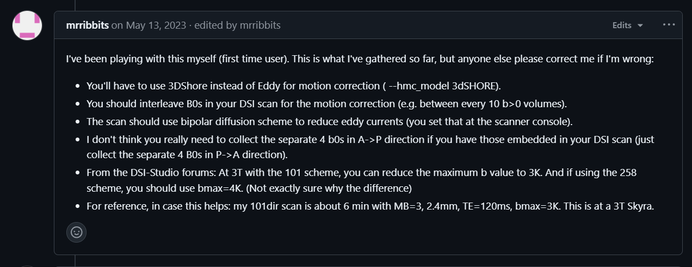

QSIPrep加速DSI预处理
====================

QSIPrep对于多壳DWI数据的预处理时间可以接受（会尝试使用eddy的cuda版本），但对于DSI数据来说，使用eddy和TOPUP校正是错误的！QSIPrep的作者多次强调过这个问题（eddy适用于多壳数据，而TOPUP又只能和eddy搭配使用）


以及



有意思的是，一些文献仍然使用eddy来处理DSI数据，例如https://onlinelibrary.wiley.com/doi/10.1002/jmri.29616

上面也提到了，目前来说可以使用3dSHORE（相当于eddy的替代）和DRBUDDI（相当于TOPUP的替代）来处理DSI数据。

## 3dSHORE

3dSHORE默认迭代次数为2，设置为1可以节省部分时间（注意目前的版本修改--shoreline-iters似乎不会在最终的html report中修改），同时这一步可以并行处理（--nprocs参数）。如果扫描的是全球的DSI数据（比如200+方向），时间则会非常久。

## DRBUDDI

幸运的是qsiprep镜像中安装的是GPU版本的[TORTOISE](https://tortoise.nibib.nih.gov/)，但默认执行的是CPU命令（猜测可能QSIPrep测试时发现运行GPU版本的命令时不稳定，见[gpu resources exceeded](https://github.com/QMICodeBase/TORTOISEV4/issues/14)），加速CPU版本的可以通过指定更高的--omp-nthreads参数。

但我们可以简单地改为使用GPU版本（DRBUDDI_cuda），**可以大幅缩短预处理时间**，以pennlinc/qsiprep:1.0.1版本为例：

```bash
mkdir -p /mnt/f/backup/qsiprep_custom # 创建一个存放自定义脚本的目录
cd /mnt/f/backup/qsiprep_custom

docker run -it --rm --entrypoint /bin/bash pennlinc/qsiprep:1.0.1

# grep -R "DRBUDDI" /opt/conda/envs/qsiprep/lib/python3.10/site-packages/qsiprep/
# 这里已知结果是/opt/conda/envs/qsiprep/lib/python3.10/site-packages/qsiprep/interfaces/tortoise.py

exit # 退出容器

docker run --rm -v /mnt/f/backup/qsiprep_custom:/mnt/out \
    --entrypoint cp pennlinc/qsiprep:1.0.1 \
    /opt/conda/envs/qsiprep/lib/python3.10/site-packages/qsiprep/interfaces/tortoise.py \
    /mnt/out/tortoise.py

# 修改tortoise.py中的DRBUDDI命令
# 第312行改为_cmd = 'DRBUDDI_cuda'
```

然后创建新的镜像：

在/mnt/f/backup/qsiprep_custom创建一个Dockerfile文件

```Dockerfile
FROM pennlinc/qsiprep:1.0.1

# Replace some interface with custom version
COPY tortoise.py /opt/conda/envs/qsiprep/lib/python3.10/site-packages/qsiprep/interfaces/tortoise.py
```

然后在/mnt/f/backup/qsiprep_custom目录下运行：

```bash
docker build -t qsiprep:1.0.1-custom .
```

如果想保存修改后的镜像，可以运行：

```bash
docker save -o /mnt/f/backup/qsiprep_custom/qsiprep_1.0.1-custom.tar qsiprep:1.0.1-custom
```

注意调用docker时需要传入GPU参数：

```bash
docker run -ti --rm \
            --gpus all \
            ...
```

## 其它可以尝试的参数

--skip-anat-based-spatial-normalization可以跳过T1w向标准空间的配准。QSIPrep使用ANTS实现，得到h5格式的变换场，时间较长。如果跳过且需要，可以考虑用Synthmorph配准后将.nii.gz格式的变换场转换为h5格式（见[Convert FreeSurfer Transform to ANTs H5 Transform (with proper header)](https://neurostars.org/t/convert-freesurfer-transform-to-ants-h5-transform-with-proper-header/29571)）

对应的文件是：
sub-XXX_from-ACPC_to-MNI152NLin2009cAsym_mode-image_xfm.h5
sub-XXX_from-MNI152NLin2009cAsym_to-ACPC_mode-image_xfm.h5

还可以通过其它命令的GPU版本替换原有命令（比如synthseg，对应的Interface在/opt/conda/envs/qsiprep/lib/python3.10/site-packages/qsiprep/interfaces/freesurfer.py），步骤和上面的类似。