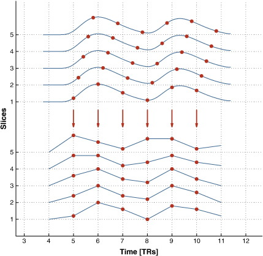

# fMRI预处理

## Multiband (MB)

参考来源：[Slice timing correction (STC) in multiband fmri (resting) - CONN toolbox](https://neurostars.org/t/slice-timing-correction-stc-in-multiband-fmri-resting-conn-toolbox/28038)；[High-pass filter and ICA-AROMA on multiband-data](https://neurostars.org/t/high-pass-filter-and-ica-aroma-on-multiband-data/21332)；[Slice timing correction - TR threshold](https://neurostars.org/t/slice-timing-correction-tr-threshold/20613)

最早学习fMRI是在卢家锋老师的课程里（[磁振影像原理與臨床研究應用](https://www.youtube.com/playlist?list=PLx_IWc-RN82vjeMBCFV0OjMnc1nBhSIUz)），但自己的数据集是multiband采集的，如何进行slice timing的校正一直没有研究过。

Slice timing的问题可以参照这篇文章[Slice-timing effects and their correction in functional MRI
](https://www.ncbi.nlm.nih.gov/pmc/articles/PMC3167249/)，就是各个层面的数据不是在一个时间点采集的，这种时间差距在fMRI中被认为是需要校正的，因为本身就是研究BOLD信号，随时间变化比较敏感。

但是multiband的数据TR很短（1s左右），根据SPM的文档（[Slice timing correction](https://www.fil.ion.ucl.ac.uk/spm/docs/tutorials/fmri/preprocessing/slice_timing/)），得到这几个信息（这里没有对multiband本身的原理进行学习）：
- 长TR的数据中，slice timing correction (STC)没有坏处，可以提高统计效力。但根据非必要不插值的观念，STC不一定是必要的，并且头动严重时STC可能有问题；
- 短TR（≤2s）数据中，可以采用*temporal derivative*的方法（具体怎么操作没有细看）；
- 短TR数据中，同样可以进行STC，但通常来说是否进行STC的影响不大。如果要校正的话，要用slice timing（不知道具体数据的话也可以自己设置，也就是根据slice order，保证层间的差距一定，标准化到TR。个人理解就是相对于用slice order引入了TR的信息？）而非slice order进行校正；
- 如果需要使用Dynamic Causal Modeling (DCM)分析fMRI数据，multiband数据也要进行STC（这里DCM只SPM界面上的DCM，但我之前都没有用过这个功能）。

关于到底需不需要做STC，比如有没有明确的TR阈值，似乎没有定论。因此，我自己对于multiband fMRI的STC的态度是，只要不犯原则性的错误，那好像校正了也无妨。

## fMRIPrep

mark：[High-pass filter and ICA-AROMA on multiband-data](https://neurostars.org/t/high-pass-filter-and-ica-aroma-on-multiband-data/21332/2)（我似乎用不到ICA，但是里面对于slice和volume的含义和ICA-AROMA的意义可能可以借鉴）

fmriprep使用session的freesurfer结果：[Can fMRIPrep use session specific freesurfer output to preprocess multiple sessions per subject?](https://neurostars.org/t/can-fmriprep-use-session-specific-freesurfer-output-to-preprocess-multiple-sessions-per-subject/4644)，但里面提到的[Enable longitudinal structural analysis](https://github.com/nipreps/smriprep/issues/429)似乎目前为止还没有解决。

fMRIPrep的教程：参考了视频[fMRIPrep_Tutorial](https://www.bilibili.com/video/BV19P4y1t7Gh/?spm_id_from=333.337.search-card.all.click&vd_source=262636e26b325960a8c21f8bb6b74f08)

fMRIPrep的默认参数是可以正确地处理multiband fMRI的STC的（只要没有大量的头动和伪影），也不会有负面的影响（[Slice time correction with multiband/short TR](https://neurostars.org/t/slice-time-correction-with-multiband-short-tr/24500)）。

## CONN

参考Andy的教程（[Functional Connectivity and the CONN Toolbox](https://andysbrainbook.readthedocs.io/en/latest/FunctionalConnectivity/CONN_Overview.html)）进行预处理。[CONN fMRI 功能连接 系列教程](https://space.bilibili.com/12739253/channel/collectiondetail?sid=3221744)也是不错的学习资源。

## dpabi

可以参考[fMRI的Multiband/多平面EPI的SliceTiming应该怎么做？(Dpabi/SPM)](https://mp.weixin.qq.com/s/KwCZXSvZjZBss2yMvxaqig)