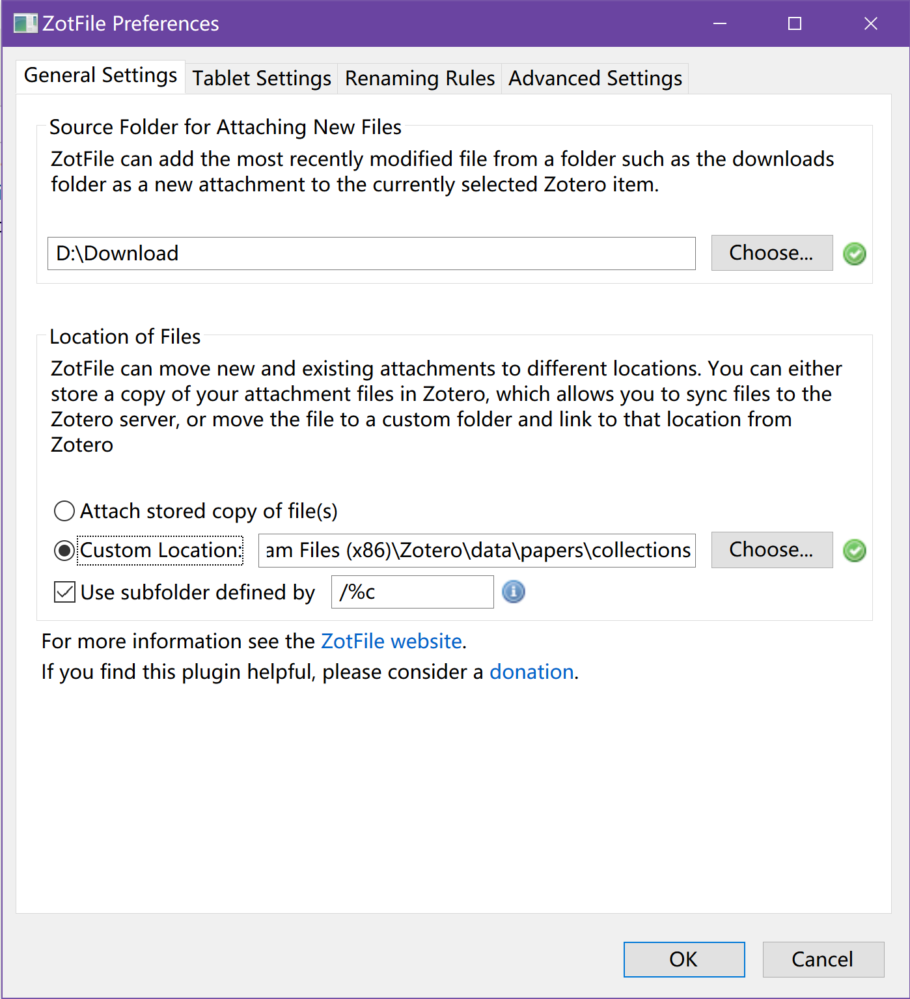
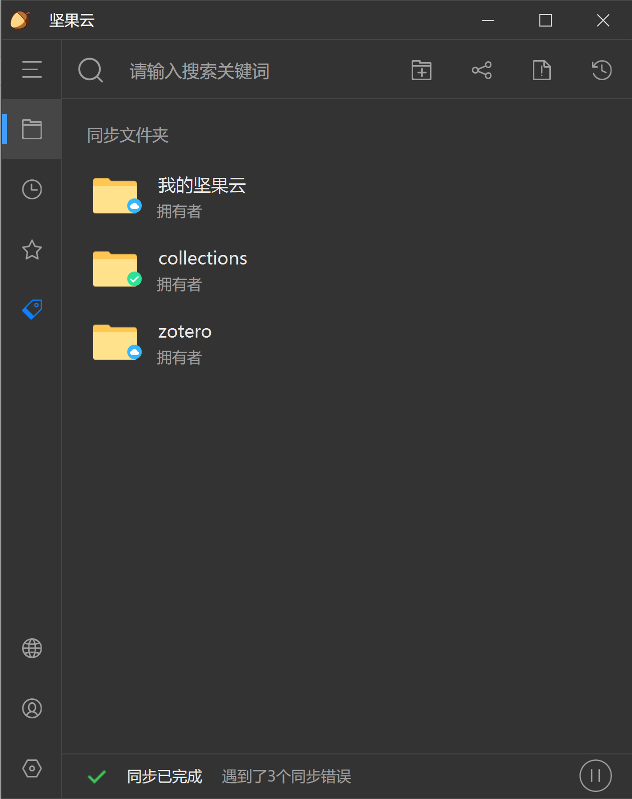

# Zotero数据和附件同步

**实现方法：坚果云手动设置同步**

因为使用了ZotFile插件移动了附件位置，直接使用Zotero+坚果云WebDAV也可以实现同步。但这种同步方法有一个问题：我平时使用Zotero都用WPS阅读pdf并进行批注，WebDAV无法自动同步pdf编辑的内容。因此选择了第一次手动设置坚果云附件的同步，之后就可以自动同步了。

另外，网络上的教程大多个几个路径设置编号，比较复杂，而且各个教程的说法不一致。下面介绍我的同步实现方法：

**ZotFile设置：**

这里参照[利用ZotFile对Zotero中的文献进行整理](https://www.cnblogs.com/komean/p/11156675.html)中的说法设置了“Custom Location”，并将附件移动到了这个指定的文件夹

接下来，将这个文件夹同步上传到坚果云（我这里根据教程命名为“collections”）

在需要同步的设备上，设置类似的“Custom Location”，然后在坚果云文件夹右侧设置->同步设置->**同步到本地**即可（请确认好同步到本地的路径，注意不要多嵌套一层文件夹）

设置好之后，相当于读取附件的文件夹通过坚果云同步了，在任意设备上进行的编辑基本可以实现秒同步，而且这种方法理论上不需要通过设置WebDAV就能实现？